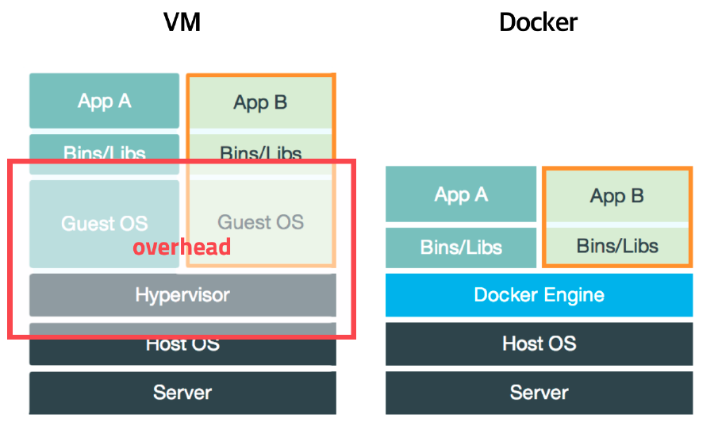
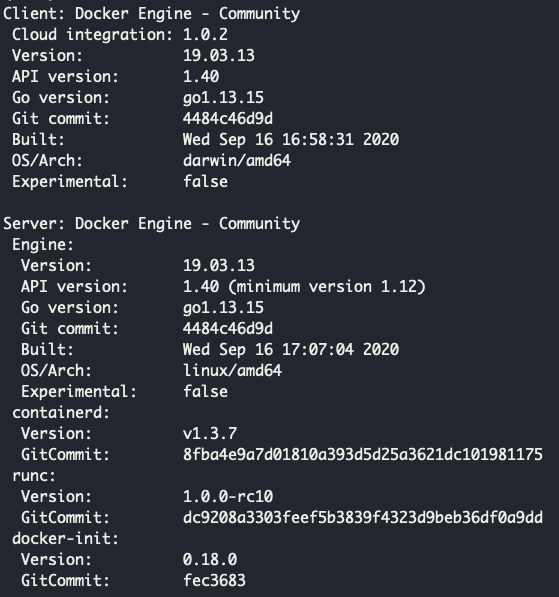
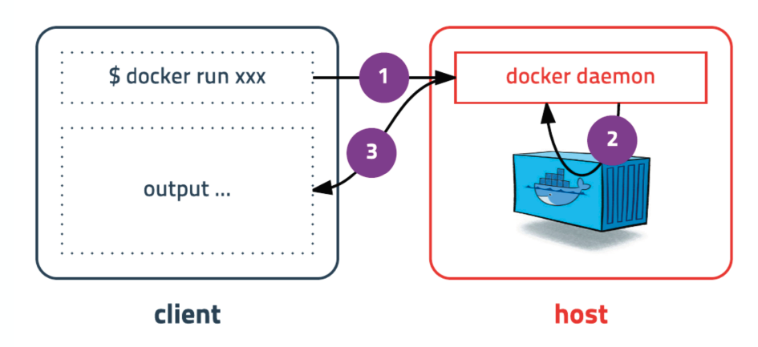
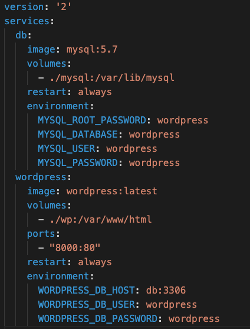

# Docker
- 도커는 **컨테이너 기반의 오픈소스 가상화 플랫폼**
- 기존의 문제를 해결하기 위한 기술
- 도커가 나오기전에 서버를 관리한다는 것은 매우 복잡하고 어려운 일이었음.
- 서버에 어떤 프로그램을 설치하는 것도 쉽지 않았고, 인프라가 바뀌는 상황에 대응하기도 어렵고, 개발환경 또한 매번 변경이 되기 때문에 그러한 상황에 문제없이 빠르게 대응하는 것은 매우 어려웠다. => 도커가 등장함에 따라 서버관리/개발 방식이 완전히 바뀌게 됨.
- 전통적인 서버관리 방식은 **유저를 등록하고, 환경설정하고 방화벽 설정하고 네트워크 설정하고 패키지 다운받고 프록시서버 설정** 등 매번 서버를 추가할 때마다 이러한 단계를 한땀한땀 설정해야함. => 도커를 사용할 경우 이러한 단계를 직접 설정할 필요가 없어짐.
- 도커는 어떠한 프로그램도 컨테이너로 만들 수 있고, 어디서든 실행 가능함.
- 도커는 가상머신처럼 각 컨테이너 별로 독립적으로 실행되지만 가상머신보다 빠르고 쉬우며 효율적이다.
  
## 도커가 나오기 전 서버를 안정적으로 운영하기 위한 노력
1. 문서화를 잘 해놓는다.
   - 구성이 조금씩 바뀌거나 할 때마다 바로 대응하기가 어렵다.
2. 상태관리 도구를 활용해서 서버를 새로 도입할 때마다 그 상태도구가 자동으로 이전 상태값을 다 설정하도록 처리하는 방법 사용.
   - 상태관리 도구를 사용하기 위한 또 다른 러닝커브 발생.
   - 또한 한 서버에 동일한 애플리케이션을 여러 개 설치하거나 하는 것이 어렵다.
3. 가상머신 이용
   - 이미지로 만들어놓고 사용하면 되지만, 다른 설정을 바꾸고 싶거나 할 경우 어떤 식으로 현재 설정되어 있고 이런 것을 알기가 어렵다.
   - 또한 애뮬레이터를 통한 실행?이기 때문에 속도가 느리다.
4. 자원격리
   - 프로세스를 가상으로 분리를 해서 각 프로세스가 각각의 환경에서 돌아가는 것처럼 분리하는 방법.
   - 파일 디렉토리도 분리.
   - CPU, 메모리 I/O => 리눅스 커널 기능을 이용해서 그룹 별로 제한.
   - 기존 리눅스 커널 기능을 이용한 빠르고 효율적인 서버 관리 방식.
   - 그러나 실제로 사용하기 어렵다

- 그리하여 기존의 리눅스의 그 어렵고 복잡한 기술을 사용하기 쉽도록 나온 것이 도커
- 컨테이너는 격리된 환경에서 작동하는 프로세스를 의미하며, 리눅스 커널의 여러가지 기술을 활용하여 만든 플랫폼이다.
- 하드웨어 가상화 기술보다 가벼우며 이미지 단위로 프로세스 실행환경을 구성한다.

## 도커란?
### VM과의 차이

- 기존의 가상머신과 다르게 Hypervisor, GuestOS 위에서 수행되는 방식이 아니고 단순히 기존 리눅스 위에서 격리만 해주는 방식이기 때문에 훨씬 빠르다.
### 도커의 특징
1. 확장성/이식성
   - 도커가 설치되어 있다면 어디서든 컨테이너 실행 가능.
   - 특정 회사나 서비스에 종속적이지 않음.

2. 표준성
   - 도커를 사용하지 않는 경우 ruby, go, php로 만든 서비스들의 배포 방식은 각각 다르다.
   - 컨테이너라는 표준으로 서버를 배포하므로 모든 서비스들의 배포과정이 동일해진다.

3. 이미지
   - 이미지란 컨테이너를 실행하기 위한 압축파일
   - 이미지에서 컨테이너를 생성한다
   - Dockerfile이라는 일종의 스크립트를 이용해 이미지를 만들 수 있다.
   - 일반적으로 빌드 서버에서 이미지를 만들면 해당 이미지를 이미지 저장소에 저장하고 운영서버에서 이미지를 불러오는 방식으로 많이 구성한다.

4. 설정관리
   - 어떤 컨테이너를 띄울 때 환경변수값을 같이 줘서 해당 컨테이너에 그 값이 설정값으로 적용되도록 할 수 있다.
   - 설정을 바꿔야 하는 경우, 환경변수만 바꿔서 새로운 컨테이너를 띄우면 된다.

5. 자원관리
   - 컨테이너는 삭제 후 새로 만들면 모든 데이터가 초기화된다.
   - 그러므로 별도의 저장소가 필요하다.

### 도커가 가져온 변화
- 다른 프로세스와 격리되어 가상머신처럼 사용하지만 가상머신에 비해 성능저하가 거의 없다.
- 복잡한 기술을 몰라도 사용할 수 있다.
- 코드와 설정으로 관리되어 재현 및 수정이 가능하다.
- 오픈소스이기 때문에 특정 회사 기술에 종속적이지 않다.
  

# 도커 설치부터 실행까지
## MacOS에서 도커 설치하는 방법
- 공식 홈페이지에서 Docker for Mac을 받아서 설치하면 됨.
- 도커는 기본적으로 리눅스의 기존 기술들을 활용해서 만든 플랫폼이기 때문에 리눅스에서는 가상머신 설치 없이 사용할 수 있으나, MacOS나 Window의 경우는 가상머신이 설치되고 그 안에 도커가 설치되는 형태이다.
- MacOS는 xhyve 가상머신(하이퍼바이저)을 사용한다.

## 설치 확인
- 터미널에서 $ docker version 하면 클아이언트와 서버 각각 정보를 보여준다.

- 도커는 클라이언트 서버 구조로 수행되며, 터미널에서 도커 관련 명령어를 수행하면 도커 데몬이 그 명령을 받아서 그에 맞는 처리를 하고 결과를 반환해주는 형태로 수행된다.

### 도커 기본 명령어
- run
  - 컨테이너 실행 명령어
  - docker run [OPTIONS] IMAGE[:TAG|@DIGEST] [COMMAND] [ARG...]
  - ex) docker run ubuntu:20.04
    - run 명령어를 사용하면 사용할 이미지가 우선 로컬에 저장되어 있는지 없는지 확인하여 없는 경우 pull을 한 후에 컨테이너를 생성하고 시작하게 된다.
    - 위와 같이 실행할 경우 컨테이너는 정상적으로 실행되나 뭘 하라고 명령어를 같이 전달하지 않았기 때문에 컨테이너는 생성되자마자 종료하게 된다.
  - ex) docker run -d -p 5678:5678 hashicorp/http-echo -text="hello world"
    - 백그라운드 모드로 실행하기 위해 -d 옵션을 추가하고 -p 옵션을 추가하여 컨테이너의 포트와 호스트의 포트를 연결함.
  - ex) docker run -d -p 3306:3306 -e MYSQL_ALLOW_EMPTY_PASSWORD=true --network=app-network --name=mysql -v /Users/doyeonkim/study/mysql:/var/lib/mysql mysql:5.7
    - 실행 중인 컨테이너를 종료하고 삭제하게 될 경우 컨테이너가 갖고 있는 데이터도 모두 삭제되게 된다. 그래서 DB 같은 경우도 생성된 데이터나 테이블들이 모두 날라가게 된다.
    - -v (volume mount) 옵션을 추가로 줌으로써 호스트 PC에도 데이터를 저장해서 만약 컨테이너를 삭제하고 다시 띄울 때도 해당 데이터를 보고 생성될 수 있도록 할 수 있다.

- exec
  - 이미 떠 있는 컨테이너에 접속할 때 사용하는 명령어로, 보안 상 ssh로 접속하지 않고 exec 명령어를 이용해 접속.

- ps
  - 실행중인 컨테이너 목록을 확인하는 명령어
  - ex) docker ps
  - 중지된 컨테이너도 확인하려면 -a 옵션을 붙여야함.

- stop
  - docker stop [OPTIONS] CONTAINER [CONTAINER...]
  - 실행중인 컨네이터를 중지하는 명령어
  - 실행중인 컨테이너를 하나 또는 여러개 중지할 수 있음.

- rm
  - docker rm [OPTIONS] CONTAINER [CONTAINER...]
  - 종료된 컨테이너를 완전히 제거하는 명령어

- log
  - docker logs [OPTIONS] CONTAINER
  - 컨테이너 로그 확인 명령어
  - -f, --tail 욥션 가능

- images
  - docker images [OPTIONS] [REPOSITORY[:TAG]]
  - 도커가 다운로드한 이미지 목록을 보는 명령어

- pull
  - docker pull [OPTIONS] NAME[:TAG|@DIGEST]
  - 이미지를 다운로드하는 명령어

- rmi
  - docker rmi [OPTIONS] IMAGE [IMAGE...]
  - 이미지를 삭제하는 명령어
  - 이미지 ID를 입력하면 삭제되며, 컨테이너가 실행 중인 이미지는 삭제되지 않음. 

- network create
  - 도커 컨테이너끼리 이름으로 통신할 수 있는 가상 네트워크를 만든다.

- network connect
  - 기존에 생성된 컨테이너에 네트워크를 추가

### 도커 컴포즈
- 도커 컴포즈는 기존에 도커를 사용해서 컨테이너를 띄우고 종료하고 할 때 명령어를 사용해서하게 되는데 명령어를 사용하면서 실수가 발생할 수도 있고 하기 때문에 어렵고 조심스럽게 사용하게 되는데 그것을 좀 더 편리하게 해주기 위한 장치이다.
- MacOS의 경우 Docker for Mac을 설치하면서 기본적으로 같이 설치되게 된다.
- 도커 컴포즈를 이용하는 방법은 우선 띄우려는 컨테이너에 대한 정보를 갖는 yaml 파일을 생성한다.

- 그리고 docker-compose up 을 하면 도커 컴포즈가 yaml 파일을 읽어서 컨테이너를 생성하고 띄우게 된다. 
- docker-compose down 을 하게되면 컨테이너가 내려가기 된다.