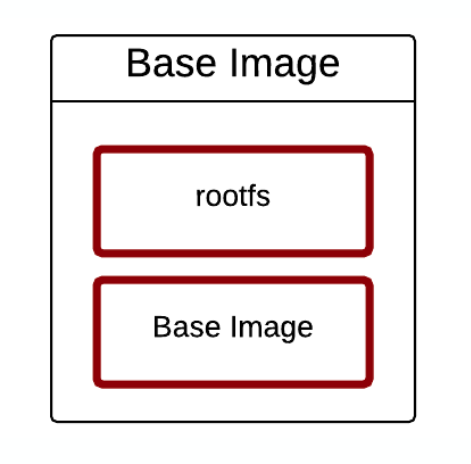
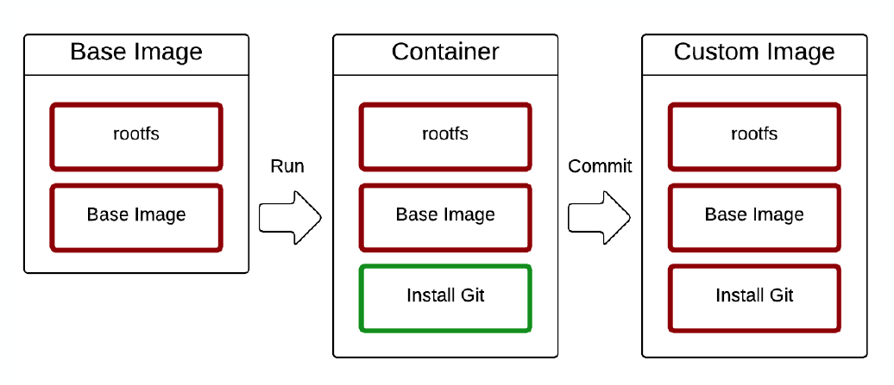
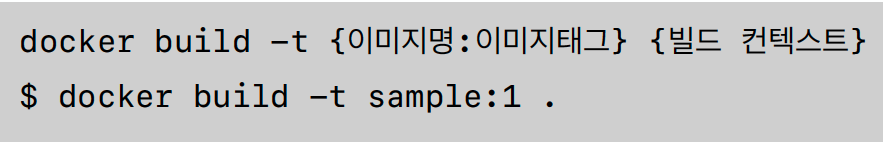
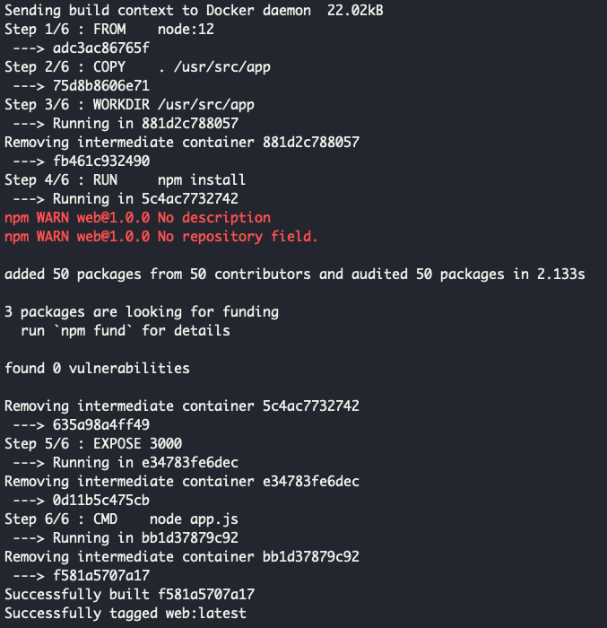
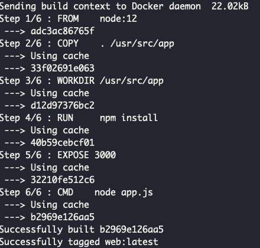
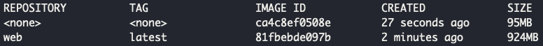
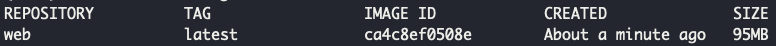

# 도커 이미지 만들고 배포하기
## 이미지란?
- 도커는 레이어드 파일 시스템 기반
- 이미지는 프로세스가 실행되는 파일들의 집합(환경)
- 프로세스가 실행되면서 생성되고 삭제되는 파일이 있는데 이미지에 쌓이게 되고 또 다른 이미지로 구성할 수 있다.
- 이미지는 읽기 전용 영역과 쓰기 가능 영역으로 나뉘는데, 기본적으로 base image는 읽기 전용이다.

- 읽기 전용 영역으로 이 부분은 변경이 불가하다. 그러나 새로 추가를 한다거나 하는 것은 가능하며, 추가한 뒤 commit을 할 경우 해당 내용도 포함된 이미지를 생성할 수 있다.

## 도커 이미지 만들기
```
$ docker run -it --name git ubuntu:latest bash 

# apt-get update
# apt-get install -y git
# git --version

docker commit git ubuntu:git
```
- ubuntu 컨테이너를 띄우고 git을 설치한 뒤, docker commit을 git이라는 컨테이너 상태 그대로 ubuntu:git이라는 이미지를 새로 만들 수 있다.
- ubuntu:git 이미지를 컨테이너로 띄우게 되면 기본적으로 git이 설치가 되어 있는 것을 확인 할 수 있다.


## 도커 이미지 빌드
- 기존의 컨테이너 상태를 commit해서 이미지를 만들 수도 있지만, Dockerfile을 이용해서 이미지를 만들 수 있다.

- Dockerfile을 생성하고 Dockerfile이 있는 위치에서 docker build를 하게될 경우 이미지가 생성되게 된다.
```
# 1. node 설치
# ubuntu:20.04 이미지를 받아서 컨테이너 띄우고
# apt-get update하고
# nodejs와 npm 설치
FROM    ubuntu:20.04
RUN     apt-get update
RUN     DEBIAN_FRONTEND=noninteractive apt-get install -y nodejs npm

# 2. 소스 복사
# 디렉토리에 있는 모든 파일을 /usr/src/app 로 복사
COPY    . /usr/src/app
WORKDIR /usr/src/app

# 3. Nodejs 패키지 설치
# 해당 위치로 이동
# npm 설치
WORKDIR /usr/src/app
RUN     npm install

# 4. WEB 서버 실행 (Listen 포트 정의)
# 3000 포트를 열겠다
# CMD에서 node app.js 명령이 실행되도록
EXPOSE 3000
CMD    node app.js
```
- .gitignore와 동일한 역할인 .dockerignore를 통해서 불필요한 파일은 이미지 생성 (빌드)에 포함되지 않도록 적용할 수 있다.
- Dockerfile을 적용하여 이미지를 만들 경우, 최초부터 어떤 작업을 했는지 Dockerfile 내용을 확인하면서 히스토리를 확인할 수가 있어서 용이하다.

## 도커 이미지 빌드 최적화
1. 이미지 최적화
    - node 서버를 컨테이너로 띄우려고 할 때, 기존에 이미지를 ubuntu:20.04 이미지를 다운받아서 컨테이너로 띄운 뒤 우분투 안에서 node를 설치하는 식으로 사용했다면, 이미 우분투에 node가 깔린 이미지 node:12를 pull 받아서 처리하도록 하면 node를 추가로 설치하거나 하는 번거로움이 사라지게 된다.
2. 캐시 특성 활용
    - 도커 이미지 빌드 시 동일한 빌드 요청 건인 경우 기존에 캐싱되어 직접 빌드하지 않는다.
    - 그러나 중간에 바뀌는 내용이 있다면 캐싱된 것을 사용하지 않고 다시 수행되게 된다.
    - 최대한 캐싱된 부분을 많이 활용되도록 조정해서 최적화 가능.


3. 이미지 용량 줄이기
    - 기본적으로 이미지의 alpine 버전은 필수적인 파일만을 담고 있는 이미지이다.
    - 해당 버전을 사용하여 이미지의 용량도 줄일 수 있다.



## Dockerfile 명령어
- FROM
  - FROM [--platform=<platform>] <image>[:<tag>] [AS <name>]
  - ex) FROM ubuntu:latest
  - 베이스 이미지 지정

- COPY
  - COPY [--chown=<user>:<group>] <src>... <dest>
  - ex) COPY index.html /var/www/html
  - 호스트에 있는 파일을 복사

- RUN
  - RUN <command>
  - ex) RUN apt-get install
  - 컨테이너에서 명령어 수행

- WORKDIR
  - WORKDIR /path/to/workdir
  - ex) WORKDIR /app
  - 작업 디렉토리 변경

- EXPOSE
  - EXPOSE <portnumber>
  - ex) EXPOSE 8000
  - 컨테이너에서 사용하는 포트 정보

- CMD
  - CMD command param1 param2
  - ex) CMD node app.js
  - 컨테이너에서 실행할 명령어

<hr>

## 도커 이미지 저장 명령어
- docker login 
  - 도커 이미지 저장소에 로그인

- docker push {ID}/example
  - 도커 이미지 저장소에 이미지 업로드

- docker pull {ID}/example
  - 도커 이미지 저장소에서 이미지 pull

> docker hub : [https://hub.docker.com/](https://hub.docker.com/)

- 이미지를 도커 이미지 저장소에 올린 후 다른 PC에서 해당하는 이미지 이름으로 run하게 되면 그 이미지가 pull되서 컨테이너가 띄워지게 된다. 