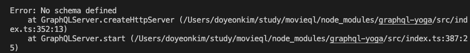
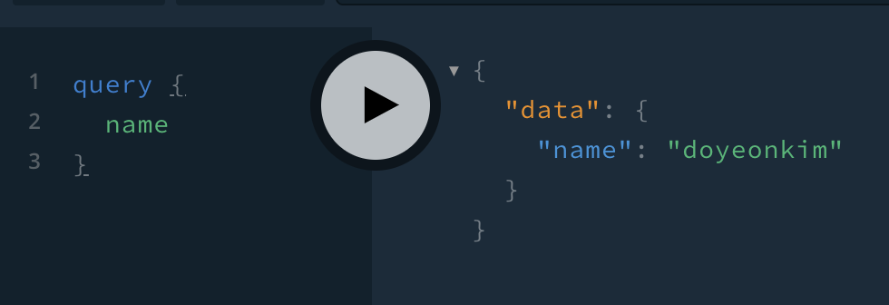

### GraphQL
- GraphQL 사용 앱 만들기
    - yarn init
    - yarn add graphql-yoga

- GraphQL을 이용하면 Over-fetching과 Under-fetching을 해결할 수 있다.

- 회원의 정보를 갖고 오는 경우
  - GET /user
  - 유저의 이름만 갖고 싶은데 이렇게 API 통신할 경우 필요없는 정보들도 다 갖고 올 수 밖에 없게 된다.
  - Over-fetching => 비효율적이고, 개발자들이 뭘 받았는지 알기도 어렵다.

- 인스타그램에 어떤 회원에 대한 화면을 보여준다고 할 때 아래와 같은 api 통신을 여러 개 호출해야한다.
  - GET /feed
  - GET /notification
  - GET /user/1

- GraphQL을 이용하면 정확하게 원하는 데이터만 받을 수 있다.
- GraphQL은 URL, URL 체계 같은 것은 아예 없고, 단순히 하나의 종점만 있다.
- 하나의 쿼리를 만들어서 데이터를 주고 받고 하는 식으로 사용할 수 있다.

```
// 이걸 백엔드에 보내면
query {
	// 피드에서는 댓글과 좋아요 수만 원하고
	feed {
		comments
		likeNumber	
	}
	// 읽었는지에 대한 알림만 원하고
	notification {
		isRead
	}
	// 유저 프로필을 원하는데
	// 이름과 프로필 사진만 원한다
	user {
	}
}
```

```
// 아래와 같은 Object를 넘겨줄 것이다
// 내가 정확하게 원한 데이터만 보내줄 것이다.
// 원하는 형태로 바꿔서 받을 수도 있고,,
// 그럼으로써 over-fetching, under-fetching 문제를 해결할 수 있다
{
	feed: [
		{
			comments:1,
			likeNumber:20
		}	
	],
	notifications: [
		{
			isRead: true
		},
		{
			isRead: false
		}
	],
	user: {
		username: "nico",
		profile: "http://"
	}
}
```
<hr>

### nodemon
- nodemon은 어떤 파일이 변경될 때마다 서버를 재시작해주는 툴?이다
- yarn global add nodemon
- package.json에 "scripts": {
    "start": "nodemon"
  } 을 넣으면 index.js가 변경될 때마다 재시작할 것이다.

<hr>

### babel-node
- babel-node는 더 좋은 코드를 작성하게 도와주는 것이다.
- yarn global add babel-cli
- .babelrc 파일 생성해서 babel 환경설정 가능
- yarn add babel-cli babel-preset-env babel-preset-stage-3 --dev


### GraphQL 서버 생성
- graphql-yoga를 이용하면 graphql 서버를 만드는 것은 매우 쉽다.

- index.js
```javascript
import { GraphQLServer } from "graphql-yoga";
import resolvers from "./graphql/resolvers";

const server = new GraphQLServer({
    typeDefs: "graphql/schema.graphql",
    resolvers
});

server.start(() => console.log("GraphQL Server Running"));
```

- new GraphQLServer를 이용해서 서버를 만들게 되는데 schema와 resolver를 인자로 넘겨줘야 한다.
- schema는 내가 어떤 데이터를 보내고 받을 것인지에 대한 설명을 의미한다.


- schema.graphql
```
type Query {
    name: String!
}
```

- 쿼리를 날릴건데 name이라는 값을 쿼리 날리면 결과로 String 값을 받겠다는 것을 의미한다.

- 스키마로 선언을 하고 나서 실제 resolver를 통해서 어떤 값을 줄 것인지 구성해야한다.

- resolvers.js
```javascript
const resolvers = {
    Query: {
        name: () => "doyeonkim"
    }
}

export default resolvers;
```

- localhost:4000으로 접속하면 GraphQL playgrounde가 뜨는데 거기서 쿼리를 작성하면 결과를 받아서 확인할 수 있다.

