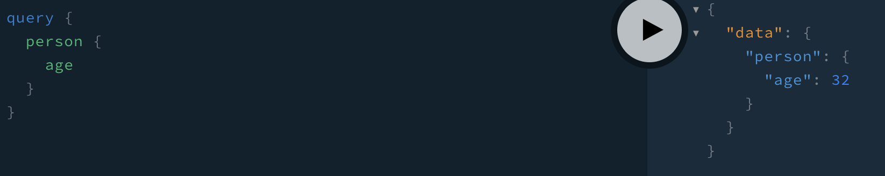

### GraphQL에서 새로운 타입으로 받고 싶은 경우
- schema.graphql
```
type doyeonkim {
    name: String!
    age: Int!
    gender: String!
}

type Query {
    person: doyeonkim!
}
```
- 새로운 타입으로 doyeonkim이라는 타입을 선언하고, 안에 어떤 타입들이 포함되는지 명시해준다.
- 그리고 쿼리에서 person을 요청하면 doyeonkim의 값을 전달하도록 선언한다.

- resolvers.js
```javascript
const doyeonkim = {
    name: "DoYeonKim",
    age: 32,
    gender: "male"
}

const resolvers = {
    Query: {
        person: () => doyeonkim
    }
}

export default resolvers;
```
- 그리고 resolver에도 person 요청 시 doyeonkim의 데이터가 전달되도록 정의해놓는다.

- playground에서 확인해보면 가능한 api 리스트를 보여준다.

- 쿼리를 날리면 결과를 준다


<hr>

