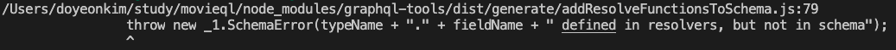

### Query와 Mutation
- GraphQL에서 Query는 말그대로 DB에 있는 데이터를 조회할 때 사용하는 것이고, Mutation은 DB에 있는 데이터를 변경할 때 사용하는 것이다.
- Mutation의 장점은 변경하고나서 값을 반환하도록 할 수 있기 때문에 변경된 결과에 대한 결과값을 받아서 처리할 때 매우 편리하다.
- schema.graphql
```
type Movie {
    id: Int!
    name: String!
    score: Int!
}

type Query {
    movies: [Movie]!
    movie(id: Int!): Movie
}

type Mutation {
    addMovie(name: String!, score: Int!): Movie!
    deleteMovie(id: Int!): Boolean!
}
```

- resolvers.js
```javascript
import { getById, getMovies, addMovie, deleteMovie } from "./db";

const resolvers = {
    Query: {
        movies: () => getMovies(),
        movie: (_, {id}) => getById(id)
    },
    Mutation: {
        addMovie: (_, {name, score}) => addMovie(name, score),
        deleteMovie: (_, {id}) => deleteMovie(id)
    }
}

export default resolvers;
```

- db.js
```javascript
let movies = [
    {
        id: 0,
        name: "Star Wars - The new one",
        score: 1
    },
    {
        id: 1,
        name: "Avengers - The new one",
        score: 8
    },
    {
        id: 2,
        name: "The Godfather I",
        score: 99
    },
    {
        id: 3,
        name: "Logan",
        score: 2
    }
];

// movies를 반환하는 함수
export const getMovies = () => movies;

// id에 해당하는 movie를 반환하는 함수
export const getById = (id) => {
    const filteredMovies = movies.filter(movie => movie.id === id);
    return filteredMovies[0];
}

// id에 해당하는 movie를 제외하는 함수
export const deleteMovie = (id) => {
    const cleanedMovies = movies.filter(movie => movie.id !== id);
    // 해당하는 id의 movie가 있어서 제외된 경우
    if (movies.length > cleanedMovies.length) {
        movies = cleanedMovies;
        return true;
    } else {
        return false;
    }
}

// add Movie
export const addMovie = (name, score) => {
    const newMovie = {
        id: `${movies.length + 1}`,
        name,
        score
    };
    movies.push(newMovie);
    return newMovie;
}
```

- schema에서 어떤 mutation과 인자를 받으면 어떤 결과를 내려줄 것인지에 대한 정의를 하고, 그것을 실제로 resolver에서 어떤 결과 or 어떤 처리를 해줄 것인지에 대한 것을 작성해두면 된다.
- resolver에만 작성한 경우 아래와 같은 에러가 발생하게 된다.

- 아래는 mutation 요청에 대한 결과

