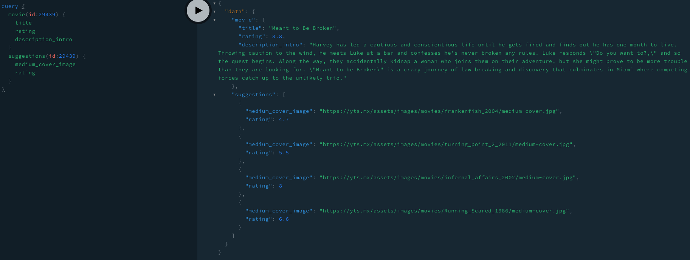

### REST API를 GraphQL로 감싸는 방법
- 기존 resolver에서 getMovies할 때 getMovies에서 fetch해서 데이터를 가지고 온 뒤 return 하는 식으로 만들면 GraphQL에서는 REST API의 결과를 가지고 다시 전달해주는 식으로 만들 수 있다.
- schema.graphql
```
type Movie {
    id: Int!
    title: String!
    rating: Float!
    summary: String!
    language: String!
    medium_cover_image: String!
}

type Query {
    movies(limit: Int, rating: Float): [Movie]!
}
```
- resolvers.js
```javascript
import { getMovies } from "./db";

const resolvers = {
    Query: {
        movies: (_, {limit, rating}) => getMovies(limit, rating)
    }
}

export default resolvers;
```
- db.js
```javascript
import fetch from "node-fetch";

const API_URL = "https://yts.am/api/v2/list_movies.json?"

export const getMovies = (limit, rating) => {
    let REQUEST_URL = API_URL;
    if (limit > 0) {
        REQUEST_URL += `limit=${limit}`;
    }
    if (rating > 0) {
        REQUEST_URL += `&minimum_rating=${rating}`;
    }
    return fetch(REQUEST_URL)
            .then(res => res.json())
            .then(json => json.data.movies);
}
```

- schema에서 Movie type을 선언하고, Query movies(limit, rating)으로 받으면 Movie type 배열로 결과를 받도록 정의.
- resolver에서는 실제로 Query movies(limit, rating)의 처리를 구현.
- getMovies(limit, rating) 메서드의 결과가 반환되도록 구현.
- getMovies는 node fetch를 이용하여 API_URL이랑 통신해서 결과값을 받아오고 json 형태로 변환해서 return하도록 구현.

<hr>

### GraphQL의 추가적인 특성
- GraphQL은 일반적인 REST API와는 다르게 한 번의 요청에 여러 Query를 날릴 수가 있다.
