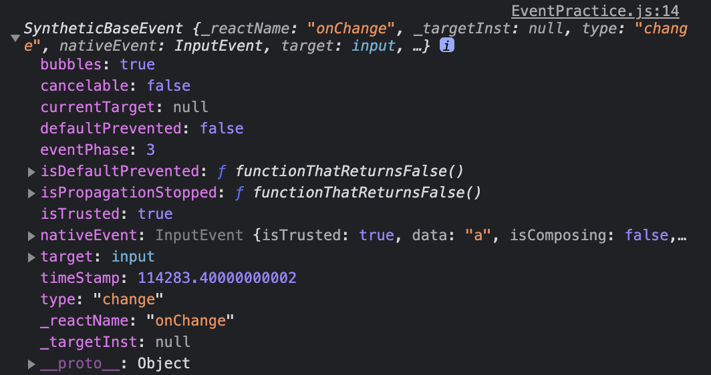

# 4. 이벤트 핸들링
- 사용자가 웹 브라우저에서 DOM 요소들과 상호 작용하는 것을 이벤트라고 한다.
## 4.1 리액트의 이벤트 시스템
### 4.1.1 이벤트를 사용할 때 주의 사항
1. 이벤트 이름은 카멜 표기법으로 작성한다. 
   - HTML의 onclick은 리액트에서 onClick으로 작성
2. 이벤트에 실행할 자바스크립트 코드를 전달하는 것이 아니라, 함수 형태의 값을 전달한다. 
3. DOM 요소에만 이벤트를 설정할 수 있다.
   - div, button, input, form, span 등의 DOM 요소에는 이벤트를 설정할 수 있으나, 직접 만든 컴포넌트에는 자체적으로 설정 불가하다.

## 4.2 예제로 이벤트 핸들링 익히기
### 4.2.1 컴포넌트 생성 및 불러오기
### 4.2.2 onChange 이벤트 핸들링하기
- EventPractice.js
```javascript
import React, { Component } from 'react';

class EventPractice extends Component {
    render() {
        return (
            <div>
                <h1>이벤트 연습</h1>
                <input
                    type="text"
                    name="message"
                    placeholder="아무거나 입력해 보세요"
                    onChange={
                        (e) => {
                            console.log(e);
                        }
                    }
                />
            </div>
        );
    }
}

export default EventPractice;
```

- 이벤트를 콘솔에 찍어보면 위와 같이 SyntheticEvent 객체로, 이 객체는 웹 브라우저의 네이티브 이벤트를 감싸는 객체이다.
> 참고 : https://ko.reactjs.org/docs/events.html

#### 4.2.2.2 state에 input 담기
- EventPractice.js
```javascript
import React, { Component } from 'react';

class EventPractice extends Component {
    state = {
        message: ''
    }

    render() {
        return (
            <div>
                <h1>이벤트 연습</h1>
                <input
                    type="text"
                    name="message"
                    placeholder="아무거나 입력해 보세요"
                    value={this.state.message}
                    onChange={
                        (e) => {
                            this.setState({
                                message: e.target.value
                            })
                        }
                    }
                />
            </div>
        );
    }
}

export default EventPractice;
```

#### 4.2.2.3 버튼을 누를 때 comment 값을 공백으로 설정
- EventPractice.js
```javascript
import React, { Component } from 'react';

class EventPractice extends Component {
    state = {
        message: ''
    }

    render() {
        return (
            <div>
                <h1>이벤트 연습</h1>
                <input
                    type="text"
                    name="message"
                    placeholder="아무거나 입력해 보세요"
                    value={this.state.message}
                    onChange={
                        (e) => {
                            this.setState({
                                message: e.target.value
                            })
                        }
                    }
                />
                <button onClick={
                    () => {
                        alert(this.state.message);
                        this.setState({
                            message: ''
                        });
                    }
                }>확인</button>
            </div>
        );
    }
}

export default EventPractice;
```

### 4.3 임의 메서드 만들기
#### 4.2.3.1 기본 방식
- EventPractice.js
```javascript
import React, { Component } from 'react';

class EventPractice extends Component {
    state = {
        message: ''
    }

    constructor(props) {
        super(props);
        this.handleChange = this.handleChange.bind(this);
        this.handleClick = this.handleClick.bind(this);
    }

    handleChange(e) {
        this.setState({
            message: e.target.value
        });
    }

    handleClick() {
        alert(this.state.message);
        this.setState({
            message: ''
        });
    }

    render() {
        return (
            <div>
                <h1>이벤트 연습</h1>
                <input
                    type="text"
                    name="message"
                    placeholder="아무거나 입력해 보세요"
                    value={this.state.message}
                    onChange={this.handleChange}
                />
                <button onClick={this.handleClick}>확인</button>
            </div>
        );
    }
}

export default EventPractice;
```
- 함수가 호출될 때 this는 호출부에 따라 결정되므로, 클래스의 임의 메서드가 특정 HTML 요소의 이벤트로 등록되는 과정에서 메서드와 this의 관계가 끊어져 버린다. 
- 이 때문에 임의 메서드가 이벤트로 등록되어도 this를 컴포넌트 자신으로 제대로 가르키키 위해서는 메서드를 this와 바인딩하는 작업이 필요하다.

#### 4.2.3.2 Property Intializer Syntax를 사용한 메서드 작성
- 메서드 바인딩은 생성자 메서드에서 하는 것이 정석이며, 새 메서드를 만들 때마다 constructor도 수정해야 하는 번거로움이 있다.
- 이 작업을 간단하게 하는 방법으로 바벨의 transform-class-properties 문법을 사용하여 화살표 함수 형태로 메서드를 정의하면 된다.
- EventPractice.js
```javascript
import React, { Component } from 'react';

class EventPractice extends Component {
    state = {
        message: ''
    }

    handleChange => (e) => {
        this.setState({
            message: e.target.value
        });
    }

    handleClick = () => {
        alert(this.state.message);
        this.setState({
            message: ''
        });
    }

    render() {
        return (
            <div>
                <h1>이벤트 연습</h1>
                <input
                    type="text"
                    name="message"
                    placeholder="아무거나 입력해 보세요"
                    value={this.state.message}
                    onChange={this.handleChange}
                />
                <button onClick={this.handleClick}>확인</button>
            </div>
        );
    }
}

export default EventPractice;
```

### 4.2.4 input 여러 개 다루기
- EventPractice.js
```javascript
import React, { Component } from 'react';

class EventPractice extends Component {
    state = {
        username: '',
        message: ''
    }

    handleChange => (e) => {
        this.setState({
            [e.target.name]: e.target.value
        });
    }

    handleClick = () => {
        alert(this.state.username + ': ' + this.state.message);
        this.setState({
            username: '',
            message: ''
        });
    }

    render() {
        return (
            <div>
                <h1>이벤트 연습</h1>
                <input
                    type="text"
                    name="username"
                    placeholder="사용자명"
                    value={this.state.username}
                    onChange={this.handleChange}
                />
                <input
                    type="text"
                    name="message"
                    placeholder="아무거나 입력해 보세요"
                    value={this.state.message}
                    onChange={this.handleChange}
                />
                <button onClick={this.handleClick}>확인</button>
            </div>
        );
    }
}

export default EventPractice;
```
- **객체 안에서 key를 '[]' 감싸면 그 안에 넣은 레퍼런스가 가리키는 실제 값이 key 값으로 사용된다.**

### 4.2.5 onKeyPress 이벤트 핸들링
- EventPractice.js
```javascript
import React, { Component } from 'react';

class EventPractice extends Component {
    state = {
        username: '',
        message: ''
    }

    handleChange => (e) => {
        this.setState({
            [e.target.name]: e.target.value
        });
    }

    handleClick = () => {
        alert(this.state.username + ': ' + this.state.message);
        this.setState({
            username: '',
            message: ''
        });
    }

    handleKeyPress = (e) => {
        if (e.key === 'Enter') {
            this.handleClick();
        }
    }

    render() {
        return (
            <div>
                <h1>이벤트 연습</h1>
                <input
                    type="text"
                    name="username"
                    placeholder="사용자명"
                    value={this.state.username}
                    onChange={this.handleChange}
                />
                <input
                    type="text"
                    name="message"
                    placeholder="아무거나 입력해 보세요"
                    value={this.state.message}
                    onChange={this.handleChange}
                    onKeyPress={this.handleKeyPress}
                />
                <button onClick={this.handleClick}>확인</button>
            </div>
        );
    }
}

export default EventPractice;
```

## 4.3 함수형 컴포넌트로 구현해 보기
- EventPractice.js
```javascript
import React, { useState } from 'react';

const EventPractice = () => {
    const [form, setForm] = useState({
        username: '',
        message: ''
    });
    const { username, message } = form;
    const onChange = e => {
        const nextForm = {
            ...form, // 기존의 form 내용을 복사한 뒤
            [e.target.name]: e.target.value // 원하는 값을 덮어 씌운다
        };
        setForm(nextForm);
    }
    const onClick = () => {
        alert(username + ": " + message);
        setForm({
            username: '',
            message: ''
        });
    };
    const onKeyPress = e => {
        if (e.key === 'Enter') {
            onClick();
        } 
    };
    return (
        <div>
            <h1>이벤트 연습</h1>
            <input
                type="text"
                name="username"
                placeholder="사용자명"
                value={username}
                onChange={onChange}
            />
            <input
                type="text"
                name="message"
                placeholder="아무거나 입력해 보세요"
                value={message}
                onChange={onChange}
                onKeyPress={onKeyPress}
            />
            <button onClick={onClick}>확인</button>
        </div>
    );
}

export default EventPractice;
```