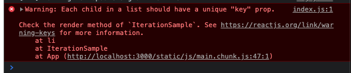

# 6. 컴포넌트 반복
## 6.1 자바스크립트 배열의 map() 함수
- 자바스크립트 배열 객체의 내장 함수인 map 함수를 사용하여 반복되는 컴포넌트를 렌더링할 수 있다.
- map 함수는 파라미터로 전달된 함수를 사용해서 배열 내 각 요소를 원하는 규칙에 따라 변환한 후 그 결과로 새로운 배열을 생성한다.

### 6.1.1 문법
```javascript
arr.map(callback, [thisArg])
```
- callback: 새로운 배열의 요소를 생성하는 함수
  - currentValue: 현재 처리하고 있는 요소
  - index: 현재 처리하고 있는 요소의 index 값
  - array: 현재 처리하고 있는 원본 배열
- thisArg (optional): callback 함수 내부에서 사용할 this 레퍼런스

## 6.2 데이터 배열을 컴포넌트 배열로 변환하기
### 6.2.1 컴포넌트 수정하기
- IterationSample.js
```javascript
import React, { useState } from 'react';

const IterationSample = () => {
    const names = ['눈사람', '얼음', '눈', '바람'];
    const nameList = names.map(name => <li>{name}</li>);
    return <ul>{nameList}</ul>;
}

export default IterationSample;
```
- App.js
```javascript
import React, { Component } from 'react';
import IterationSample from './IterationSample';

class App extends Component {
  render() {
    return (
      <IterationSample />
    );
  }
}

export default App;
```
- 위와 같이 할 경우 콘솔에 에러가 찍히게 된다.  


## 6.3 key
- 리액트에서 key는 컴포넌트 배열을 렌더링했을 때 어떤 원소에 변동이 있었는지 알아내려고 사용한다.
- 유동적인 데이터를 다룰 때는 원소를 새로 생성할 수도, 제거할 수도, 수정할 수도 있는데, key가 없을 경우 Virtual DOM을 비교하는 과정에서 리스트를 순차적으로 비교하면서 변화를 감지한다. 하지만 key가 있다면 이 값을 사용하여 어떤 변화가 일어났는지 더욱 빠르게 알아낼 수 있다.

### 6.3.1 key 설정
- key 값을 설정할 때는 map 함수의 인자로 전달되는 함수 내부에서 컴포넌트 props를 설정하듯이 설정하면 된다. 
- key 값은 언제나 유일해야 한다.
- map 함수에 전달되는 콜백 함수의 인수인 index 값을 활용해도 된다.
- IterationSample.js
```javascript
import React, { useState } from 'react';

const IterationSample = () => {
    const names = ['눈사람', '얼음', '눈', '바람'];
    const nameList = names.map((name, index) => <li key={index}>{name}</li>);
    return <ul>{nameList}</ul>;
}

export default IterationSample;
```
- App.js
```javascript
import React, { Component } from 'react';
import IterationSample from './IterationSample';

class App extends Component {
  render() {
    return (
      <IterationSample />
    );
  }
}

export default App;
```
- 그러나 고유한 값이 없을 때만 index 값을 key로 사용해야 한다. index를 key로 사용하면 배열이 변경될 때 효율적으로 리렌더링하지 못한다.

## 6.4 응용
### 6.4.1 초기 상태 설정하기
- IterationSample.js
```javascript
import React, { useState } from 'react';

const IterationSample = () => {
    const [names, setNames] = useState([
        { id: 1, text: '눈사람' },
        { id: 2, text: '얼음' },
        { id: 3, text: '눈' },
        { id: 4, text: '바람' }
    ]);
    const [inputText, setInputText] = useState('');
    const [nextId, setNextId] = useState(5);

    const namesList = names.map(name => <li key={name.id}>{name.text}</li>);
    return <ul>{namesList}</ul>;
}

export default IterationSample;
```

### 6.4.2 데이터 추가 기능 구현하기
- IterationSample.js
```javascript
import React, { useState } from 'react';

const IterationSample = () => {
    const [names, setNames] = useState([
        { id: 1, text: '눈사람' },
        { id: 2, text: '얼음' },
        { id: 3, text: '눈' },
        { id: 4, text: '바람' }
    ]);
    const [inputText, setInputText] = useState('');
    const [nextId, setNextId] = useState(5);

    const onChange = e => setInputText(e.target.value);
    const onClick = () => {
        const nextNames = names.concat({
            id: nextId,
            text: inputText
        });
        setNextId(nextId + 1);
        setNames(nextNames);
        setInputText('');
    };

    const namesList = names.map(name => <li key={name.id}>{name.text}</li>);
    return (
        <>
            <input value={inputText} onChange={onChange} />
            <button onClick={onClick}>추가</button>
            <ul>{namesList}</ul>
        </>
    );
}

export default IterationSample;
```
- 배열에 새 항목을 추가할 때 배열의 push 함수를 사용하지 않고 concat을 사용했는데, push 함수는 기존 배열 자체를 변경해 주는 반면, concat은 새로운 배열을 만들어 준다.
- **리액트에서 상태를 업데이트할 때는 기존 상태를 그대로 두면서 새로운 값을 상태로 설정해야 한다. 이를 불변성 유지라고 하는데, 불변성 유지를 해 주어야 나중에 리액트 컴포넌트의 성능을 최적화할 수 있다.**

### 6.4.3 데이터 제거 기능 구현하기
- 불변성을 유지하면서 배열의 특정 항목을 지울 때는 배열의 내장 함수 filter를 사용한다.
- filter 함수를 사용하면 배열에서 특정 조건을 만족하는 원소들만 쉽게 분류할 수 있다.
- IterationSample.js
```javascript
import React, { useState } from 'react';

const IterationSample = () => {
    const [names, setNames] = useState([
        { id: 1, text: '눈사람' },
        { id: 2, text: '얼음' },
        { id: 3, text: '눈' },
        { id: 4, text: '바람' }
    ]);
    const [inputText, setInputText] = useState('');
    const [nextId, setNextId] = useState(5);

    const onChange = e => setInputText(e.target.value);
    const onClick = () => {
        const nextNames = names.concat({
            id: nextId,
            text: inputText
        });
        setNextId(nextId + 1);
        setNames(nextNames);
        setInputText('');
    };
    const onRemove = id => {
        const nextNames = names.filter(name => name.id !== id);
        setNames(nextNames);
    };

    const namesList = names.map(name => 
        <li key={name.id} onDoubleClick={() => onRemove(name.id)}>
            {name.text}
        </li>
    );
    return (
        <>
            <input value={inputText} onChange={onChange} />
            <button onClick={onClick}>추가</button>
            <ul>{namesList}</ul>
        </>
    );
}

export default IterationSample;
```
