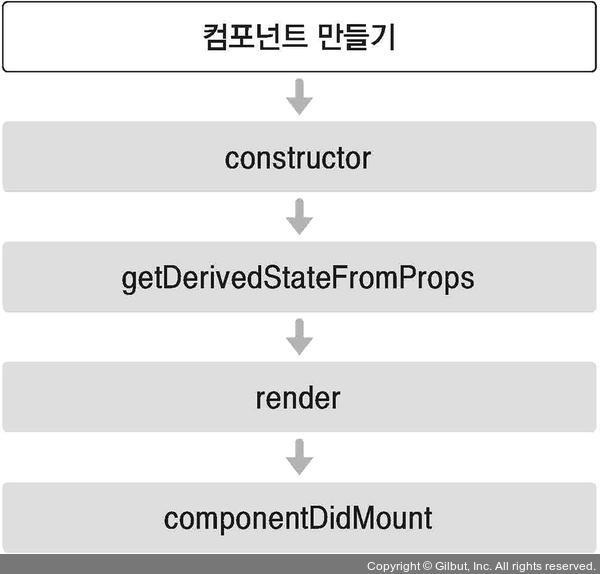
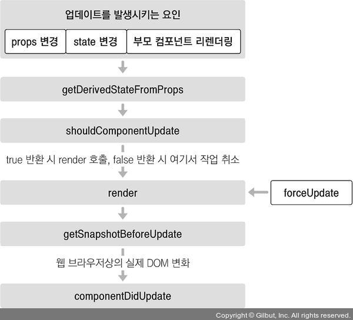

# 7. 컴포넌트의 라이프사이클 메서드
- 모든 리액트 컴포넌트에는 라이프사이클이 존재한다.
- 컴포넌트의 수명은 페이지에 렌더링되기 전인 준비 과정에서 시작하여 페이지에서 사라질 때 끝난다.
- 리액트 프로젝트를 진행하다 보면 컴포넌트를 처음으로 렌더링할 때 어떤 작업을 처리해야 하거나 컴포넌트를 업데이트하기 전후로 어떤 작업을 처리해야 할 수도 있고, 불필요한 업데이트를 방지해야 할 수도 있다.
- 이 때 컴포넌트의 라이프사이클 메서드를 사용한다.
- **라이프사이클 메서드는 클래스형 컴포넌트에서만 사용할 수 있으나, 대신 함수형 컴포넌트의 경우 Hooks 기능을 사용하여 비슷한 작업을 처리할 수 있다.**

## 7.1 라이프사이클 메서드의 이해
- 라이프사이클 메서드의 종류는 총 9가지.
- Will 접두사가 붙은 메서드는 어떤 작업을 작동하기 전에 실행되는 메서드.
- Did 접두사가 붙은 메서드는 어떤 작업을 작동한 후에 실행되는 메서드.
- 이 메서드들을 컴포넌트 클래스에서 덮어 써 선언함으로써 사용할 수 있음.
- 라이프사이클은 크게 총 세 가지, 마운트, 업데이트, 언마운트 카테고리로 나뉜다.
#
### 마운트
- DOM이 생성되고 웹 브라우저상에 나타나는 것을 마운트라고 한다.



- constructor : 컴포넌트를 새로 만들 때마다 호출되는 클래스 생성사 메서드.
- getDerivedStateFromProps : props에 있는 값을 state에 넣을 때 사용하는 메서드.
- render : UI를 렌더링하는 메서드.
- componentDidMount : 컴포넌트가 웹 브라우저 상에 나타난 후 호출하는 메서드.
#
### 업데이트
- 컴포넌트는 총 네 가지 경우에 업데이트한다.
  1. props가 바뀔 때
  2. state가 바뀔 때
  3. 부모 컴포넌트가 리렌더링될 때
  4. this.forceUpdate로 강제로 렌더링을 트리거할 때  
- 컴포넌트는 다양한 이유로 업데이트될 수 있다.
- 첫째, 부모 컴포넌트에서 넘겨주는 props가 바뀔 때. 컴포넌트에 전달하는 props의 값이 바뀌면 컴포넌트 렌더링이 이루어진다.
- 둘째, 컴포넌트 자신이 들고 있는 state가 setState를 통해 업데이트될 때.
- 셋째, 부모 컴포넌트가 리렌더링될 때.



- getDerivedStateFromProps : 이 메서드는 마운트 과정에서도 호출되며, 업데이트가 시작하기 전에도 호출된다. 
- shouldComponentUpdate : 컴포넌트가 리렌더링을 해야 할지 말아야 할지를 결정하는 메서드. 이 메서드에서는 true 또는 false를 반환해야 하며, true를 반환하면 다음 라이프사이클 메서드를 계속 실행하고, false를 반환하면 이후 작업을 중지하게 된다. 만약 특정 함수에서 this.forceUpdate() 함수를 호출하게되는 경우 이 과정을 생략하고 바로 render 함수를 호출한다.
- render : 컴포넌트를 리렌더링한다.
- getSnapshotBeforeUpdate : 컴포넌트 변화를 DOM에 반영하기 바로 직전에 호출하는 메서드
- componentDidUpdate : 컴포넌트의 업데이트 작업이 끝난 후 호출하는 메서드

### 언마운트
- 마운트의 반대 과정, 컴포넌트를 DOM에서 제거하는 것을 언마운트라고 한다.


- componentWillUnmount : 컴포넌트가 웹 브라우저상에서 사라지기 전에 호출하는 메서드.

## 7.2 라이프사이클 메서드 살펴보기
### 7.2.1 render() 함수
```javascript
render() { ... }
```
- 컴포넌트의 모양새를 정의하는 함수로, 가장 중요한 메서드.
- 라이프사이클 메서드 중 유일한 필수 메서드이다.
- 이 메서드 안에서 this.props와 this.state에 접근할 수 있으며, 리액트 요소를 반환한다. 요소는 div 같은 태그가 될 수도 있고 따로 선언한 컴포넌트가 될 수도 있다. 아무것도 보여주고 싶지 않은 경우 null이나 false를 반환하면 된다.
- 이 메서드 안에서는 이벤트 설정이 아닌 곳에서 setState를 사용하면 안되며, 브라우저의 DOM에 접근해서도 안됨.

### 7.2.2 constructor 메서드
```javascript
constructor(props) { ... }
```
- 컴포넌트의 생성자 메서드로 컴포넌트를 만들 때 처음으로 실행된다.
- 이 메서드에서는 초기 state를 정할 수 있다.

### 7.2.3 getDerivedStateFromProps 메서드
- 리액트 v16.3 이후에 새로 만든 라이프사이클 메서드로, props로 받아 온 값을 state에 동기화시키는 용도로 사용하며, 컴포넌트가 마운트될 때와 업데이트될 때 호출된다.
```javascript
static getDerivedStateFromProps(nextProps, prevState) {
    if (nextProps.value !== prevState.value) {
        return { value: nextProps.value };
    }
    return null;
}
```

### 7.2.4 componentDidMount 메서드
```javascript
componentDidMount() { ... }
```
- 이것은 컴포넌트를 만들고 첫 렌더링을 마친 후 실행된다. 
- 이 안에서 다른 자바스크립트 라이브러리 또는 프레임워크의 함수를 호출하거나 이벤트 등록, setTimeout, setInterval, 네트워크 요청 같은 비동기 작업을 처리하면 된다.

### 7.2.5 shouldComponentUpdate 메서드
- 이것은 props 또는 state를 변경했을 때, 리렌더링을 시작할 지 여부를 지정하는 메서드. 이 메서드에서는 반드시 true 값 또는 false 값을 반환해야 한다. 컴포넌트를 만들 때 이 메서드를 따로 생성하지 않으면 기본적으로 언제나 true 값을 반환한다. 이 메서드가 false 값을 반환한다면 업데이트 과정은 여기서 중지된다.
- 이 메서드 안에서 현재 props와 state는 this.props와 this.state로 접근하고, 새로 설정될 props 또는 state는 nextProps와 nextState로 접근할 수 있다.

### 7.2.6 getSnapshotBeforeUpdate 메서드
- 리액트 v16.3 이후 만든 메서드로, 이 메서ㄴ드는 render에서 만들어진 결과물이 브라우저에 실제로 반영되기 직전에 호출된다. 이 메서드에서 반환하는 값은 componentDidUpdate에서 세 번째 파라미터인 snapshot 값으로 전달받을 수 있으며, 주로 업데이트하기 직전의 값을 참고할 일이 있을 때 활용된다.
```javascript
getSnapshotBeforeUpdate(prevProps, prevState) {
    if (prevState.array !== this.state.array) {
        const { scrollTop, scrollHeight } = this.list;
        return { scrollTop, scrollHeight };
    }
} 
```

### 7.2.7 componentDidUpdate 메서드
```javascript
componentDidUpdate(prevProps, prevState, snapshot) { ... }
```
- 리렌더링을 완료한 후 실행되는 메서드. 
- 업데이트가 끝난 직후이므로, DOM 관련 처리를 해도 무방하다. 
- 여기서는 prevProps 또는 prevState를 사용하여 컴포넌트가 이전에 가졌던 데이터에 접근할 수 있으며, 또는 getSnapshotBeforeUpdate에서 반환한 값이 있다면 여기서 snapshot 값을 전달받을 수 있다.

### 7.2.8 componentWillUnmount 메서드
```javascript
componentWillUnmout() { ... }
```
- 이것은 컴포넌트를 DOM에서 제거할 때 실행한다.
- componentDidMount에서 등록한 이벤트, 타이머, 직접 생성한 DOM이 있다면 여기서 제거 작업을 해야 한다.

### 7.2.8 componentDidCatch 메서드
- 리액트 v16에서 새롭게 도입되었으며, 컴포넌트 렌더링 도중에 에러가 발생했을 때 애플리케이션이 먹통이 되지 않고 오류 UI를 보여 줄 수 있게 해준다.
```javascript
componentDidCatch(error, info) {
    this.setState({
        error: true
    });
    console.log({ error, info });
}
```
- error는 어떤 에러가 발생했는지 알려 주며, info 파라미터는 어디에 있는 코드에서 오류가 발생했는지에 대한 정보를 준다.
- 그러나 이 메서드를 사용할 때는 컴포넌트 자신에게 발생하는 에러를 잡아낼 수 없고, 자신의 this.props.children으로 전달되는 컴포넌트에서 발생하는 에러만 잡아낼 수 있다.

## 7.3 라이프사이클 메서드 사용하기
### 7.3.1 예제 컴포넌트 생성
- LifeCycleSample.js
```javascript
import React, { Component } from 'react';

class LifeCycleSample extends Component {
    state = {
        number: 0,
        color: null,
    }

    myRef = null;

    constructor(props) {
        super(props);
        console.log('constructor');
    }

    static getDerivedStateFromProps(nextProps, prevState) {
        console.log('getDerivedStateFromProps');
        if (nextProps.color !== prevState.color) {
            return { color: nextProps.color };
        }
        return null;
    }

    componentDidMount() {
        console.log('componentDidMount');
    }

    shouldComponentUpdate(nextProps, nextState) {
        console.log('shouldComponentUpdate', nextProps, nextState);
        return nextState.number % 10 !== 4;
    }

    componentWillUnmount() {
        console.log('componentWillUnmount');
    }

    handleClick = () => {
        this.setState({
            number: this.state.number + 1
        });
    }

    getSnapshotBeforeUpdate(prevProps, prevState) {
        console.log('getSnapshotBeforeUpdate');
        if (prevProps.color !== this.props.color) {
            return this.myRef.style.color;
        }
        return null;
    }

    componentDidUpdate(prevProps, prevState, snapshot) {
        console.log('componentDidUpdate', prevProps, prevState);
        if (snapshot) {
            console.log('업데이트 되기 직전 색상', snapshot);
        }
    }

    render() {
        console.log('render');
        const style = {
            color: this.props.color
        };

        return (
            <div>
                {this.props.missing.value}
                <h1 style={style} ref={ref => this.myRef=ref}>
                    {this.state.number}
                </h1>
                <p>color: {this.state.color}</p>
                <button onClick={this.handleClick}>
                    더하기
                </button>
            </div>
        )
    }
}

export default LifeCycleSample;
```
- 각 상태 별로 로그를 찍도록 처리.
#
- App.js
```javascript
import React, { Component } from 'react';
import LifeCycleSample from './LifeCycleSample';

function getRandomColor() {
  return '#' + Math.floor(Math.random() * 16777215).toString(16);
}

class App extends Component {
  state = {
    color: '#000000'
  }

  handleClick = () => {
    this.setState({
      color: getRandomColor()
    });
  }

  render() {
    return (
      <div>
        <button onClick={this.handleClick}>랜덤 색상</button>
        <LifeCycleSample color={this.state.color}/>
      </div>
    );
  }
}

export default App;
```
- 랜덤 색상 버튼을 클릭 시 setState가 되면서 리렌더링되게 되고 LifeCycleSample 컴포넌트로 넘기는 props가 변경되게 된다.
- 그럼 LifeCycleSample 컴포넌트는 업데이트되게 되고, 해당하는 라이프사이클 메서드들이 차례로 수행되게 된다.
- getDerivedStateFromProps에서 새로 넘겨받은 nextProps와 prevState(현재 state 값)을 비교하여 다른 경우 nextProps을 nextState에 동기화시켜준다.
- shouldComponentUpdate에서 nextProps와 nextState를 파라미터로 받아 조건에 따라 true, false를 넘겨 다음 메서드들을 수행할 것인지 말 것인지 처리한다.
- render에서 이제 변경된 props와 state를 가지고 다시 리렌더링하게 된다.
- 그 후에 getSnapshotBeforeUpdate에서 prevProps와 prevState을 파라미터로 받아서 현재 props의 값과 다른 경우 기존에 ref이 갖고 있던 style props를 반환한다.
- 마지막으로 componentDidUpdate가 수행되어 getSnapshotBeforeUpdate에서 넘겨준 snapshot을 로그로 찍도록 처리한다.