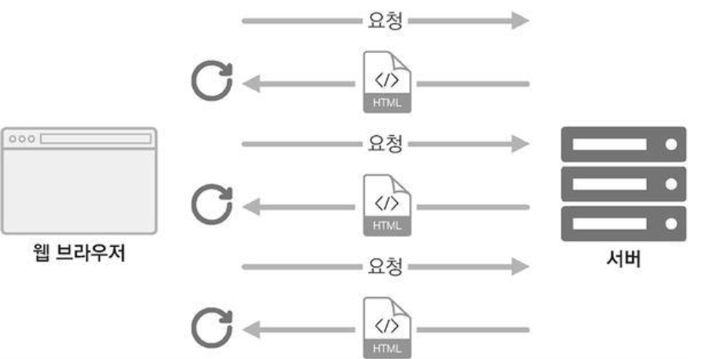
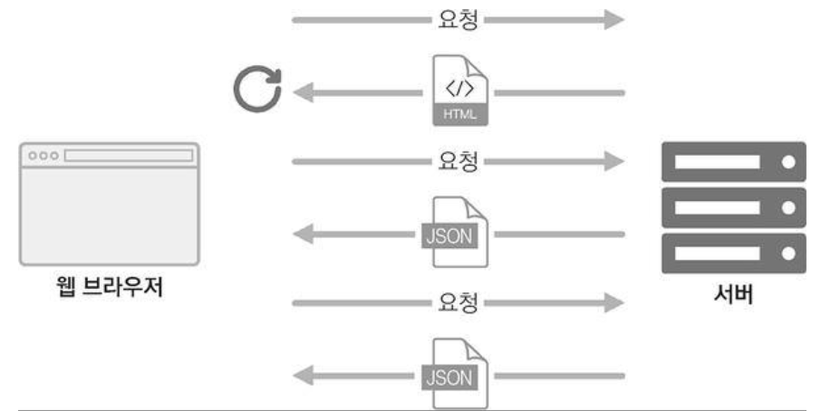

# 13. 리액트 라우터로 SPA 개발하기
## 13.1 SPA란?
- SPA는 Single Page Application의 약어이다.
- 한 개의 페이지로 이루어진 애플리케이션이라는 의미.
- 전통적인 웹 페이지는 다음과 같이 여러 페이지로 구성되어 있다.



- 기존에는 사용자가 다른 페이지로 이동할 때마다 새로운 html을 받아 오고, 페이지를 로딩할 때마다 서버에서 리소스를 전달받아 해석한 뒤 화면에 보여주었다. 이렇게 사용자에게 보이는 화면은 서버 측에서 준비해서 전달하였다.
- 사전에 html 파일을 만들어서 제공하거나, 데이터에 따라 유동적인 html을 생성해 주는 템플릿 엔진을 사용하기도 했음.
- **요즘은 웹에서 제공되는 정보가 정말 많기 때문에 새로운 화면을 보여 주어야 할 때마다 서버 측에서 모든 뷰를 준비한다면 성능상의 문제가 발생할 수 있다.**
- 예를 들면 트래픽이 너무 많이 나올 수도 있고, 사용자가 몰려 서버에 높은 부하가 쉽게 걸릴 수도 있다. **속도와 트래픽 측면에서는 캐싱과 압축을 해서 서비스를 제공하면 어느 정도 최적화될 수 있으나, 사용자와의 인터랙션이 자주 발생하는 모던 웹 애플리케이션에는 적당하지 않을 수 있다.**
- 애플리케이션 내에서 화면 전환이 일어날 때마다 html을 계속 서버에 새로 요청하면 사용자의 인터페이스에서 사용하고 있던 상태를 유지하는 것도 번거롭고, 바뀌지 않는 부분까지 새로 불러와서 보여 주어야 하기 때문에 불필요한 로딩이 있어서 비효율적이다.
- 그래서 **리액트 같은 라이브러리 혹은 프레임워크를 사용하여 뷰 렌더링을 사용자의 브라우저가 담당하도록 하고, 우선 애플리케이션을 브라우저에 불러와서 실행시킨 후에 사용자와의 인터랙션이 발생하면 필요한 부분만 자바스크립트를 사용하여 업데이트 한다.** 만약 새로운 데이터가 필요한 경우에는 서버 API를 호출하여 필요한 데이터만 새로 불러와 애플리케이션에서 사용할 수도 있다.



- 싱글 페이지라고 해서 화면이 한 종류는 아니며, SPA의 경우 서버에서 사용자에게 제공하는 페이지는 한 종류이지만, 해당 페이지에서 로딩된 자바스크립트와 현재 사용자 브라우저의 주소 상태에 따라 다양한 화면을 보여 줄 수 있다.
- 다른 주소에 다른 화면을 보여 주는 것을 라우팅이라고 한다. 리액트 라이브러리 자체에 이 기능이 내장되어 있지는 않으며, 대신 브라우저의 API를 직접 사용하여 관리하거나, 라이브러리를 사용하여 쉽게 구현할 수 있다.
- 리액트 라우팅 라이브러리는 리액틑 라우터, 리치 라우터, Next.js 등 여러 가지가 있다.

### 13.1.1 SPA의 단점
- SPA의 단점은 앱의 규모가 커지면 자바스크립트 파일이 너무 커진다는 것. 페이지 로딩 시 사용자가 실제로 방문하지 않을 수도 있는 페이지의 스크립트도 불러오기 때문. 이는 코드 스플리팅을 사용하여 라우트별로 파일을 나누어 개선할 수 있다.
- 리액트 라우터처럼 브라우저에서 자바스크립트를 사용하여 라우팅을 관리하는 것은 자바스크립트를 실행하지 않는 일발 크롤러에서는 페이지의 정보를 제대로 수집해 가지 못한다는 잠재적인 단점이 따른다. 이러한 문제점은 서버 사이드 렌더링 (SSR)을 통해 모두 해결 할 수 있다.

## 13.2 프로젝트 준비 및 기본적인 사용법
### 13.2.1 프로젝트 생성 및 라이브러리 설치
> $ yarn create react-app router-tutorial  
> $ cd router-tutorial  
> $ yarn add react-router-dom

- 리액트 프로젝트를 새로 생성 후 yarn을 사용하여 react-router-dom이라는 라이브러리를 설치.

### 13.2.2 프로젝트에 라우터 적용
- index.js
```javascript
import React from 'react';
import ReactDOM from 'react-dom';
import { BrowserRouter } from 'react-router-dom';
import './index.css';
import App from './App';
import reportWebVitals from './reportWebVitals';

ReactDOM.render(
  <BrowserRouter>
    <App />
  </BrowserRouter>,
  document.getElementById('root')
);

// If you want to start measuring performance in your app, pass a function
// to log results (for example: reportWebVitals(console.log))
// or send to an analytics endpoint. Learn more: https://bit.ly/CRA-vitals
reportWebVitals();
```
- 리액트 라우터를 적용할 때는 react-router-dom에 내장되어 있는 BrowserRouter라는 컴포넌트를 사용하여 감싸면 된다. 
- 이 컴포넌트는 웹 애플리케이션에 HTML5의 History API를 사용하여 페이지를 새로고침하지 않고도 주소를 변경하고, 현재 주소에 관련된 정보를 props로 쉽게 조회하거나 사용할 수 있도록 해 준다.

### 13.2.3 페이지 만들기
- Home.js
```javascript
import React from 'react';

const Home = () => {
    return (
        <div>
            <h1>홈</h1>
            <p>홈, 그 페이지는 가장 먼저 보여지는 페이지.</p>
        </div>
    );
};

export default Home;
```
- About.js
```javascript
import React from 'react';

const About = () => {
    return (
        <div>
            <h1>소개</h1>
            <p>이 프로젝트는 리액트 라우터 기초를 실습해 보는 예제 프로젝트입니다</p>
        </div>
    );
};

export default About;
```

### 13.2.4 Route 컴포넌트로 특정 주소에 컴포넌트 연결
- Route라는 컴포넌트를 사용하여 사용자의 현재 경로에 따라 다른 컴포넌트를 보여 줄 수 있다.
- Route 컴포넌트를 사용하면 어떤 규칙을 가진 경로에 어떤 컴포넌트를 보여 줄 지 정의할 수 있다.
```javascript
<Route path="주소규칙" component={보여 줄 컴포넌트} />
```
- App.js
```javascript
import React from 'react';
import { Route } from 'react-router-dom';
import About from './About';
import Home from './Home';

const App = () => {
    return (
      <div>
        <Route path="/" component={Home} />
        <Route path="/about" component={About} />
      </div>
    );
};

export default App;
```
- /about 경로로 들어가면 About 컴포넌트만 나오는 것이 아니고 Home 그리고 About 컴포넌트 둘 다 모두 나타나게 된다. /about 경로가 / 규칙에도 일치하기 때문인데, 이를 exact라는 props를 true로 설정하면 정확하게 일치하는 경로만 해당 컴포넌트로 노출되게끔 할 수 있다.

### 13.2.5 Link 컴포넌트를 사용하여 다른 주소로 이동하기
- Link 컴포넌트는 클릭하면 다른 주소로 이동시켜 주는 컴포넌트이다.
- **일반 웹 애플리케이션에서는 a 태그를 사용하여 페이지를 전환하는데, 리액트 라우터를 사용할 때는 이 태그를 직접 사용하면 안 된다. 이 태그는 페이지를 전환하는 과정에서 페이지를 새로 불러오기 때문에 애플리케이션이 들고 있던 상태들을 모두 날려버리게 된다.** 렌더링된 컴포넌트들도 모두 사라지고 다시 처음부터 렌더링하게 된다.
- **Link 컴포넌트를 사용하여 페이지를 전환하면, 페이지를 새로 불러오지 않고 애플리케이션은 그대로 유지한 상태에서 HTML5 History API를 사용하여 페이지의 주소만 변경해 준다.**
- **Link 컴포넌트 자체는 a 태그로 이루어져 있으나, 페이지 전환을 방지하는 기능이 내장되어 있다.**
```javascript
<Link to="주소">내용</Link>
```
- App.js
```javascript
import React from 'react';
import { Route, Link } from 'react-router-dom';
import About from './About';
import Home from './Home';

const App = () => {
    return (
      <div>
        <ul>
          <li>
            <Link to="/">홈</Link>
          </li>
          <li>
            <Link to="/about">소개</Link>
          </li>
        </ul>
        <hr />
        <Route path="/" component={Home} exact={true} />
        <Route path="/about" component={About} />
      </div>
    );
};

export default App;
```

## 13.3 Route 하나에 여러 개의 path 설정하기
- Route 하나에 여러 개의 path를 지정하는 것은 최신 버전의 리액트 라우터 v5부터 적용된 기능이다.
- path props를 배열로 설정해 주면 여러 경로에서 같은 컴포넌트를 보여 줄 수 있다.
- App.js
```javascript
import React from 'react';
import { Route, Link } from 'react-router-dom';
import About from './About';
import Home from './Home';

const App = () => {
    return (
      <div>
        <ul>
          <li>
            <Link to="/">홈</Link>
          </li>
          <li>
            <Link to="/about">소개</Link>
          </li>
        </ul>
        <hr />
        <Route path="/" component={Home} exact={true} />
        <Route path={['/about', '/info']} component={About} />
      </div>
    );
};

export default App;
```

## 13.4 URL 파라미터와 쿼리
### 13.4.1 URL 파라미터
- /profile/{username}와 같은 형식으로 Profile 페이지에서 파라미터를 받아서 처리하도록 할 수 있다.
- Profile.js
```javascript
import React from 'react';

const data = {
    doyeon: {
        name: '김땡땡',
        description: '리액트를 좋아하는 개발자'
    },
    gildong: {
        name: '홍길동',
        description: '고전 소설 홍길동전의 주인공'
    }
};

const Profile = ({ match }) => {
    const { username } = match.params;
    const profile = data[username];
    if (!profile) {
        return <div>존재하지 않는 사용자입니다.</div>;
    }
    return (
        <div>
            <h3>
                {username}({profile.name})
            </h3>
            <p>{profile.description}</p>
            <WithRouterSample />
        </div>
    );
};

export default Profile;
```
- URL 파라미터를 사용할 때는 라우트로 사용되는 컴포넌트에서 받아오는 match라는 객체 안의 params 값을 참조한다. match 객체 안에는 현재 컴포넌트가 어떤 경로 규칙에 의해 보이는지에 대한 정보가 들어있다.
- Profile 컴포넌트를 위한 라우트를 정의할 때는 /profile/:username이라고 넣어주면 된다. 이렇게 설정할 경우 match.params.username 값을 통해 현재 username 값을 조회할 수 있다.
- App.js
```javascript
import React from 'react';
import { Route, Link } from 'react-router-dom';
import About from './About';
import Home from './Home';
import Profile from './Profile';

const App = () => {
    return (
      <div>
        <ul>
          <li>
            <Link to="/">홈</Link>
          </li>
          <li>
            <Link to="/about">소개</Link>
          </li>
          <li>
            <Link to="/profile/chikeem90">chikeem90 프로필</Link>
          </li>
          <li>
            <Link to="/profile/gildong">chikeem90 프로필</Link>
          </li>
        </ul>
        <hr />
        <Route path="/" component={Home} exact={true} />
        <Route path={['/about', '/info']} component={About} />
        <Route path="/profile/:username" component={Profile} />
      </div>
    );
};

export default App;
```

### 13.4.2 URL 쿼리
- 쿼리는 location 객체에 들어 있는 search 값에서 조회할 수 있다.
- location 객체는 라우트로 사용된 컴포넌트에게 props로 전달되며, 웹 애플리케이션의 현재 주소에 대한 정보를 지니고 있다.
- 주소가 http://localhost:3000/about?detail=true 일 때 location 구조는 아래와 같다.
```javascript
{
    "pathname": "/about",
    "search": "?detail=true",
    "hash": ""
}
```
- search 값은 문자열 형태로 되어 있다. search 값에서 특정 값을 읽어 오기 위해서는 이 문자열을 객체 형태로 변환해 주어야 한다.
- 쿼리 문자열을 객체로 변환할 때는 qs라는 라이브러리를 사용하면 된다.
> $ yarn add qs
- About.js
```javascript
import React from 'react';
import qs from 'qs';

const About = ({ location }) => {
    const query = qs.parse(location.search, {
        ignoreQueryPrefix: true
    });
    const showDetail = query.detail === 'true';
    return (
        <div>
            <h1>소개</h1>
            <p>이 프로젝트는 리액트 라우터 기초를 실습해 보는 예제 프로젝트입니다.</p>
            {showDetail && <p>detail 값을 true로 설정하셨군요!</p>}
        </div>
    );
};

export default About;
```
- **쿼리를 사용할 때는 쿼리 문자열을 객체로 파싱하는 과정에서 결과 값은 언제나 문자열인 것을 주의해야 한다.**


## 13.5 서브 라우트
- 서브 라우트란 라우트 내부에 또 라우트를 정의하는 것을 의미함.
- 단순히 라우트로 사용되고 있는 컴포넌트의 내부에 Route 컴포넌트를 또 사용하면 된다.
- Profiles.js
```javascript
import React from 'react';
import { Link, Route } from 'react-router-dom';
import Profile from './Profile';

const Profiles = () => {
    return (
        <div>
            <h3>사용자 목록:</h3>
            <ul>
                <li>
                    <Link to="/profiles/chikeem90">chikeem90</Link>
                </li>
                <li>
                    <Link to="/profiles/gildong">gildong</Link>
                </li>
            </ul>
            <Route
                path="/profiles"
                exact
                render={() => <div>사용자를 선택해 주세요.</div>}
            />
            <Route path="/profiles/:username" component={Profile} />
        </div>
    );
};

export default Profiles;
```
- 기존의 App 컴포넌트에서는 두 종류의 프로필 링크를 보여주었는데, 이를 잘라내어 프로필 링크를 보여 주는 Profiles라는 라우트 컴포넌트를 따로 만들고, 그 안에서 Profile 컴포넌트를 서브 라우트로 사용하도록 만들었다.
- **이 코드에서 첫 번째 Route 컴포넌트에는 component 대신 render props를 넣어 주었는데, 컴포넌트 자체를 전달하는 것이 아니라 보여 주고 싶은 JSX를 넣어 줄 수 있다. 따로 컴포넌트를 만들기 애매한 상황에 사용하거나 컴포넌트에 props를 별도로 넣어 주고 싶을 때도 사용할 수 있다.**
- JSX에서 props를 설정할 때 값을 생략하면 자동으로 true로 설정된다. 예를 들어 exact={true} 대신 그냥 exact라고만 적어도 동일하게 적용된다.
- App.js
```javascript
import React from 'react';
import { Route, Link } from 'react-router-dom';
import About from './About';
import Home from './Home';
import Profiles from './Profiles';

const App = () => {
    return (
      <div>
        <ul>
          <li>
            <Link to="/">홈</Link>
          </li>
          <li>
            <Link to="/about">소개</Link>
          </li>
          <li>
            <Link to="/profiles">프로필</Link>
          </li>
        </ul>
        <hr />
        <Route path="/" component={Home} exact={true} />
        <Route path={['/about', '/info']} component={About} />
        <Route path="/profiles" component={Profiles} />
      </div>
    );
};

export default App;
```

## 13.6 리액트 라우터 부가 기능
### 13.6.1 history
- history 객체는 라우트로 사용된 컴포넌트에 match, location과 함께 전달되는 props 중 하나로, 이 객체를 통해 컴포넌트 내에 구현하는 메서드에서 라우터 API를 호출할 수 있다.
- 예를 들어 특정 버튼을 눌렀을 때 뒤로 가거나, 로그인 후 화면을 전환하거나, 다른 페이지로 이탈하는 것을 방지해야 할 때 history를 활용한다.
- HistorySample.js
```javascript
import React, { Component } from 'react';

class HistorySample extends Component {
    // 뒤로 가기
    handleGoBack = () => {
        this.props.history.goBack();
    };

    // 홈으로 이동
    handleGoHome = () => {
        this.props.history.push();
    };

    componentDidMount() {
        this.unblock = this.props.history.block('정말 떠나실 건가요?');
    }
    
    componentWillUnmount() {
        // 컴포넌트가 언마운트되면 질문을 멈춤
        if (this.unblock) {
            this.unblock();
        }
    }

    render() {
        return (
            <div>
                <button onClick={this.handleGoBack}>뒤로</button>
                <button onClick={this.handleGoHome}>홈으로</button>
            </div>
        );
    }
}

export default HistorySample;
```
- App.js
```javascript
import React from 'react';
import { Route, Link } from 'react-router-dom';
import About from './About';
import HistorySample from './HistorySample';
import Home from './Home';
import Profiles from './Profiles';

const App = () => {
    return (
      <div>
        <ul>
          <li>
            <Link to="/">홈</Link>
          </li>
          <li>
            <Link to="/about">소개</Link>
          </li>
          <li>
            <Link to="/profiles">프로필</Link>
          </li>
          <li>
            <Link to="/history">History 예제</Link>
          </li>
        </ul>
        <hr />
        <Route path="/" component={Home} exact={true} />
        <Route path={['/about', '/info']} component={About} />
        <Route path="/profiles" component={Profiles} />
        <Route path="/history" component={HistorySample} />
      </div>
    );
};

export default App;
```

### 13.6.2 withRouter
- withRouter 함수는 HoC(Higher-order Component)이다. 
- 라우트로 사용된 컴포넌트가 아니어도 match, location, history 객체를 접근할 수 있게 해 준다.
- WithRouterSample.js
```javascript
import React from 'react';
import { withRouter } from 'react-router-dom';

const WithRouterSample = ({ location, match, history }) => {
    return (
        <div>
            <h4>location</h4>
            <textarea
                value={JSON.stringify(location, null, 2)}
                rows={7}
                readOnly={true}
            />
            <h4>match</h4>
            <textarea 
                value={JSON.stringify(match, null, 2)}
                rows={7}
                readOnly={true}
            />
            <button onClick={() => history.push('/')}>홈으로</button>
        </div>
    );
};

export default withRouter(WithRouterSample);
```
- withRouter를 사용할 때는 컴포넌트를 내보내 줄 때 함수로 감싸준다.
- JSON.stringify의 두 번째 파라미터와 세 번째 파라미터를 위와 같이 null, 2로 설정해주면 JSON에 들여쓰기가 적용된 상태로 문자열이 만들어진다.
- Profile.js
```javascript
import React from 'react';
import { withRouter } from 'react-router-dom';
import WithRouterSample from './WithRouterSample';

const data = {
    doyeon: {
        name: '김땡땡',
        description: '리액트를 좋아하는 개발자'
    },
    gildong: {
        name: '홍길동',
        description: '고전 소설 홍길동전의 주인공'
    }
};

const Profile = ({ match }) => {
    const { username } = match.params;
    const profile = data[username];
    if (!profile) {
        return <div>존재하지 않는 사용자입니다.</div>;
    }
    return (
        <div>
            <h3>
                {username}({profile.name})
            </h3>
            <p>{profile.description}</p>
            <WithRouterSample />
        </div>
    );
};

export default Profile;
```

### 13.6.3 Switch
- Switch 컴포넌트는 여러 Route를 감싸서 그중 일치하는 단 하나의 라우트만을 렌더링시켜 준다.
- Switch를 사용하면 모든 규칙과 일치하지 않을 때 보여 줄 Not Found 페이지도 구현할 수 있다.
- App.js
```javascript
import React from 'react';
import { Route, Link, Switch } from 'react-router-dom';
import About from './About';
import HistorySample from './HistorySample';
import Home from './Home';
import Profiles from './Profiles';

const App = () => {
    return (
      <div>
        <ul>
          <li>
            <Link to="/">홈</Link>
          </li>
          <li>
            <Link to="/about">소개</Link>
          </li>
          <li>
            <Link to="/profiles">프로필</Link>
          </li>
          <li>
            <Link to="/history">히스토리</Link>
          </li>
        </ul>
        <hr />
        <Switch>
          <Route path="/" component={Home} exact={true} />
          <Route path={['/about', '/info']} component={About} />
          <Route path="/profiles" component={Profiles} />
          <Route path="/history" component={HistorySample} />
          <Route
            render={({ location }) => (
              <div>
                <h2>이 페이지는 존재하지 않습니다:</h2>
                <p>{location.pathname}</p>
              </div>
            )}
          />
        </Switch>
      </div>
    );
};

export default App;
```

### 13.6.4 NavLink
- NavLink는 Link와 비슷하지만, 현재 경로와 Link에서 사용하는 경로가 일치하는 경우 특정 스타일 또는 CSS 클래스를 적용할 수 있는 컴포넌트이다.
- NavLink에서 링크가 활성화되었을 때의 스타일을 적용할 때는 activeStyle 값을, CSS 클래스를 적용할 때는 activeClassName 값을 props로 넣어 주면 된다.
- Profiles.js
```javascript
import React from 'react';
import { Link, NavLink, Route } from 'react-router-dom';
import Profile from './Profile';

const Profiles = () => {
    const activeStyle = {
        background: 'black',
        color: 'white'
    };
    return (
        <div>
            <h3>사용자 목록:</h3>
            <ul>
                <li>
                    <NavLink activeStyle={activeStyle} to="/profiles/chikeem90" active>
                        chikeem90
                    </NavLink>
                </li>
                <li>
                    <NavLink activeStyle={activeStyle} to="/profiles/gildong">
                        gildong
                    </NavLink>
                </li>
            </ul>
            <Route
                path="/profiles"
                exact
                render={() => <div>사용자를 선택해 주세요.</div>}
            />
            <Route path="/profiles/:username" component={Profile} />
        </div>
    );
};

export default Profiles;
```