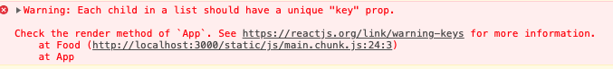
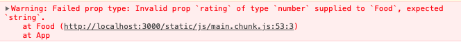

### 여러 컴포넌트를 그릴 때 주의할 점?
- 여러 컴포넌트를 그릴 때, 각 컴포넌트들을 구분할 수 있는 값이 있어야 함.
- 그러한 구분 값이 없을 경우 아래와 같이 콘솔에 찍히게 된다.


```javascript
import React from "react";

function Food({ name, picture }) {
  return (
    <div>
      <h2>I like {name}</h2>
      
    </div>
  )
}

const foodILike = [
  {
    id: 1,
    name: "Kimchi",
    image: ""
  },
  {
    id: 2,
    name: "Samgyeopsal",
    image: ""
  },
  {
    id: 3,
    name: "Bibimbap",
    image: ""
  },
  {
    id: 4,
    name: "Doncasu",
    image: ""
  },
  {
    id: 5,
    name: "Kimbap",
    image: ""
  }
]

function App() {
  return (
    <div>
      <h1>Hello</h1>
      {foodILike.map(dish => <Food key={dish.id} name={dish.name} picture={dish.image}/>)}
    </div>
  );
}

export default App;
```

- foodIlike 배열의 각 오브젝트에 id값을 추가로 부여해서 
  Food 컴포넌트에 key라는 프로퍼티에 id값을 넘기도록 처리하면 된다.

  <hr>

### prop의 값을 체크하는 방법
- PropTypes를 이용하면 내가 프로퍼티에 대한 정합성 체크를 쉽게 할 수 있다.
- 우선 prop-types는 추가로 설치해야함.
- yarn add prop-types
- ' import PropTypes from "prop-types"; ' 를 상단에 추가
- 그리고 원하는 컴포넌트에 **propTypes라는 이름으로 프로퍼티를 부여**

```javascript
Food.propTypes = {
  name: PropTypes.string.isRequired,
  picture: PropTypes.string.isRequired,
  rating: PropTypes.string.isRequired
};
```

- 받아야할 값의 타입과 필수여부체크 등 프로퍼티에 대한 정합성 체크를 쉽게 할 수 있다.
- 만약 지키지 않는 경우 아래와 같이 브라우저 콘솔에 에러가 찍히게 된다.


<hr>

### Class 컴포넌트란?
- 기존에 계속 사용해왔던 컴포넌트는 Function 컴포넌트임. 
- Function 컴포넌트는 내부에서 return을 해주는 식으로 사용함.
- Class 컴포넌트는 React.Component를 확장해서 사용을 하며 render 메서드를 활용해서 그리도록 사용함.
```javascript
class App extends React.Component {
  state = {
    count: 0
  }

  add = () => {
    console.log("add");
  };
  minus = () => {
    console.log("minus");
  };
  
  render() {
    return (
      <div>
        <h1>The number is: {this.state.count}</h1>
        <button onClick={this.add}>Add</button>
        <button onClick={this.minus}>Minus</button>
      </div>
    );
  }
}
```
- 리액트는 자동적으로 모든 Class 컴포넌트의 render 메서드를 실행하준다.
- 또한 Class 컴포넌트는 Function 컴포넌트와 다르게 state를 갖는다.
- state는 Object이고, 컴포넌트의 데이터를 넣을 수 있고 또 그 데이터를 변경시킬 수 있다.

> this.add()으로 호출하는 것은 즉시 호출하는 것이고, this.add는 click했을 때만 호출되게 하는 것

<hr>

### state란?
- state는 Class 컴포넌트가 갖는 상태값으로 Object 형태이며, 여러 액션에 따라 변경될 수 있는 값을 가진다.
- state값을 직접 접근하거나 변경하는 것은 권장되지 않는다.
- 특히 state값을 변경하는 경우, 값은 변경되어도 그게 실제로 HTML에 적용되지 않는다.
- 따라서 setState 메서드를 활용해서 새로 set하려는 Object를 set해주면 리액트가 내부적으로 state의 값을 변경해주고 rerendering을 통해서 실제 HTML에도 반영되게끔 처리가 된다.
- 즉, render 메서드를 다시 호출함으로써 해당 변경된 값으로 다시 그리도록 처리가 되는 것이다.
- 또한 state의 값을 가지고 올 때도 직접 접근하기보다는 함수의 형태로 ' current => ({count : current.count + 1}) '처럼 사용해서 현재 값에 접근하도록 사용하는 것이 좋다.
```javascript
import React from "react";
import PropTypes from "prop-types";

class App extends React.Component {
  state = {
    count: 0
  }

  add = () => {
    this.setState(current => ({count : current.count + 1 }));
  };
  minus = () => {
    this.setState(current => ({count : current.count - 1 }));
  };
  
  render() {
    return (
      <div>
        <h1>The number is: {this.state.count}</h1>
        <button onClick={this.add}>Add</button>
        <button onClick={this.minus}>Minus</button>
      </div>
    );
  }
}

export default App;
```

<hr>

### 리액트 컴포넌트 라이프사이클 메서드
- react component는 render 메서드 뿐만 아니라 다양한 메서드들도 제공을 하는데, 그 중에서도 lifecycle을 관리하는 메서드를 제공하고 있다.
- lifecycle 메서드는 기본적으로 리액트가 컴포넌트를 생성하고 없애는 방법?을 가지는 메서드임.
- 컴포넌트가 생성될 때 render 되기 전, render 된 후, update 될 때 각각 호출되는 메서드들이 존재한다.

1. Mounting
    - 컴포넌트가 생성될 때 단계
    - constructor()가 호출되고 그다음 render() 그리고 componentDidMount()가 호출된다.
    - componentDidMount()는 컴포넌트가 최초 생성될 때 한번 수행된다.

2. Updating
    - setState를 할 때 단계
    - setState를 하게되면 내부적으로 해당 컴포넌트의 render를 호출하게 되고 그다음 업데이트가 완료될 경우 componentDidUpdate가 수행된다.

3. Unmounting
    - 다른 페이지로 이동하거나 하는 경우의 단계.
    - componentWillUnmount의 메서드가 수행된다.

