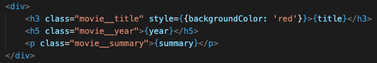
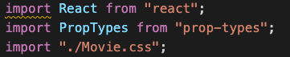
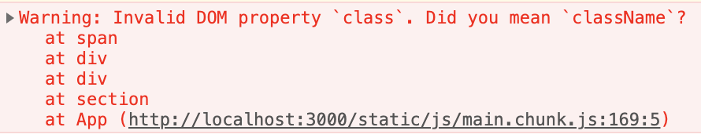
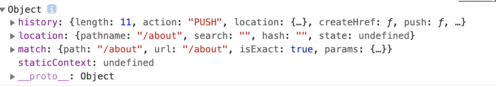
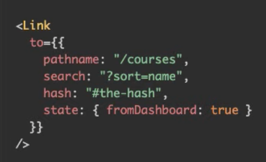
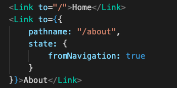
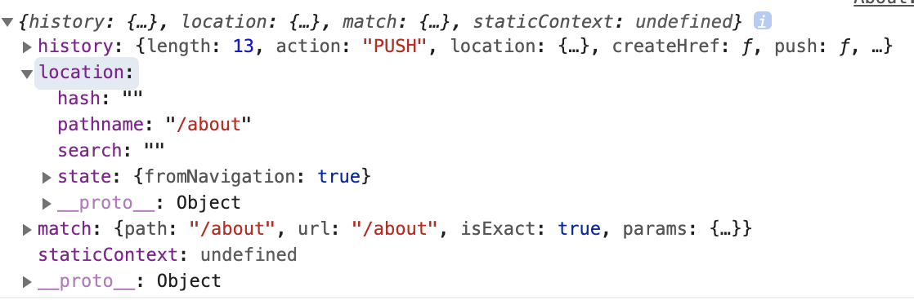

### CSS 적용하는 방법
- 기존 HTML과 유사하게 해당 마크업에 직접 적용하는 방법

- css파일을 따로 두고 적용하는 방법.
- css파일을 따로 두고 적용할 경우 적용되는 컴포넌트에 해당 css를 import를 해줘야한다.


<hr>

### JSX 사용 시 주의해야할 점
- JSX는 보기엔 HTML과 유사하지만 엄연히 다른 표현 방식이다.
- JavaScript에서 class 키워드는 JavaScript가 지원하는 class를 의미하기 때문에 리액트가 혼동할 수 있다. 

- 그렇기 때문에 유사하게 className으로 프로퍼티를 주게 된다.
```javascript
<h3 className="movie__title">{title}</h3>
<h5 className="movie__year">{year}</h5>
<ul className="genres">
    {genres.map((genre, index) => (
        <li key={index} className="genres__genre">{genre}</li>
    ))}
</ul>
<p className="movie__summary">{summary}</p>
```
- 유사하게 \<label for=""> 의 경우도 \<label htmlFor=""> 이런 식으로 사용해야한다.

<hr>

### JavaScript Array에서 기본적으로 제공하는 map의 특징
- map에 있는 각각 요소들을 그릴 때 key값이 필요하다. 
- map의 경우 Array의 각 요소들 뿐만 아니라 index값도 넘겨주게 된다.
- 그 값을 활용해서 넘기도록 사용하면 된다.

<hr>

### github에 배포하기
- gh-pages를 이용하면 쉽게 github에 배포할 수 있다.
> npm i gh-pages
- package.json에 homepage값을 추가한다.
> https://{username}.github.io/movie_app_2019
- gh-pages를 설치 후 package.json에 deploy와 predeploy 명령과 어떤 것을 수행할 것인지 추가한다.

```
{
  "name": "movie_app_2019",
  "version": "0.1.0",
  "private": true,
  "dependencies": {
    "@testing-library/jest-dom": "^5.11.4",
    "@testing-library/react": "^11.1.0",
    "@testing-library/user-event": "^12.1.10",
    "axios": "^0.21.1",
    "gh-pages": "^3.1.0",
    "prop-types": "^15.7.2",
    "react": "^17.0.1",
    "react-dom": "^17.0.1",
    "react-scripts": "4.0.3",
    "web-vitals": "^1.0.1"
  },
  "scripts": {
    "start": "react-scripts start",
    "build": "react-scripts build",
    "deploy": "gh-pages -d build",
    "preddeploy": "npm run build"
  },
  "eslintConfig": {
    "extends": [
      "react-app",
      "react-app/jest"
    ]
  },
  "browserslist": {
    "production": [
      ">0.2%",
      "not dead",
      "not op_mini all"
    ],
    "development": [
      "last 1 chrome version",
      "last 1 firefox version",
      "last 1 safari version"
    ]
  },
  "homepage": "https://chikeem90.github.io/movie_app_2019"
}
```

- 추가한 뒤 ' npm run deploy ' 하는 경우, predeploy가 먼저 수행되어 build를 수행할 것이고 build 폴더가 생성될 것이다. 그리고 나서 deploy가 수행되서 gh-pages를 이용해서 build 폴더를 업로드하게 된다.

<hr>

### Router
- react-router-dom는 네비게이션을 만들어주는 추가적인 패키지
> npm i react-router-dom
- 라우터는 매우 심플한 리액트 컴포넌트이다.
- 라우터를 사용하는 이유는 라우터의 경우 url을 보고 원하는 컴포넌트를 보여주는 식으로 사용할 때 유용하기 때문이다.
- /home -> Home.js, /about -> About.js 이런 식으로 렌더링 되도록 할 수 있다.
- react router는 여러 종류의 라우터를 갖는다.

- App.js
```javascript
import React from "react";
import { HashRouter, Route } from "react-router-dom";
import Home from "./routes/Home";
import About from "./routes/About";
import Navigation from "./components/Navigation";

function App() {
  return (
  <HashRouter>
    <Navigation />
    <Route path="/" exact={true} component={Home} />
    <Route path="/about" component={About} />
  </HashRouter>
  );
}

export default App;
```

- Navigation.js
```javascript
import React from "react";
import { Link } from "react-router-dom";

function Navigation() {
    return (
        <div>
            <Link to="/">Home</Link>
            <Link to="/about">About</Link>
        </div>
    )
}

export default Navigation;
```

- 라우터는 현재 url을 기준으로 일치하는 것을 모두 찾아서 렌더링하므로 path를 줄 때 유의해야한다. 또는 exact 프로퍼티를 줘서 정확하게 일치하는 경우에만 렌더링되도록 처리할 수 있다.

- 네비게이션 컴포넌트를 만들 때 \<a href="">\</a>를 쓰게되면 원하는 이동이 되지 않을 뿐만 아니라 페이지가 완전히 새로고침 되므로 라우터에서 제공하는 Link를 이용해서 링크를 걸어야 한다.
- \<Link to="/home">Home\</Link>
- Link를 이용할 경우 페이지를 전체 새로고침하지 않고 빠르게 로딩되게 된다.
- Link는 Router 내에서만 작동하므로 항상 Router 내에 포함되어 있어야 한다.

> Router의 종류에 HashRouter, BrowserRouter가 있는데, HashRouter의 경우 url 중간에 '/#/' 가 붙게 된다.

<hr>

### 라우터 Props
- 모든 라우터는 기본적으로 아래와 같은 props을 가진다.

- Link는 Object 형태로 to를 지정할 수 있다.

- 위와 같이 두 특성을 활용하여 Link에도 해당 프로퍼티값들을 쉽게 넘길 수 있다.

- to 프로퍼티에 fromNavigation이라는 state를 같이 넘기도록 할 경우, 해당 링크를 클릭해서 url로 이동하게 되면 해당 값도 같이 넘어가게 된다.


