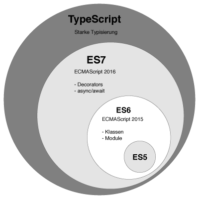

# 타입스크립트 프로그래밍
# 01. 타입스크립트와 개발 환경 만들기
## 01-1 타입스크립트란 무엇인가?
- 자바스크립트는 현재 세 가지 종류가 있다.
- ES5, ESNext, TypeScript
#

- ESNext는 ES5의 모든 문법을 포함하고, 타입스크립트는 ESNext의 모든 문법을 포함한다. 따라서 타입스크립트로 개발했더라도 타입 기능을 사용하지 않은 경우 ESNext 소스나 마찬가지다.
### 트랜스파일
- ESNext 자바스크립트 소스코드는 바벨(Babel)이라는 트랜스파일러(transplier)를 거치면 ES5 자바스크립트 코드로 변환된다. 
- 바벨과 유사하게 타입스크립트 소스코드는 TSC(TypeScript compiler)라는 트랜스파일러를 통해 ES5 자바스크립트 코드로 변환된다.

## 01-2 타입스크립트 주요 문법
### ESNext 주요 문법 살펴보기
- 비구조화 할당
- 화살표 함수
- 클래스
- 모듈
- 생성기
- Promise와 async/await 구문

### 타입스크립트 고유의 문법 살펴보기
1. 타입 주석과 타입 추론
   - 타입스크립트는 변수에 타입을 지정할 수 있는데, 변수 뒤에 작성하는 것을 타입 주석이라고 한다.
   - 타입 부분을 생략할 수도 있는데, 타입스크립트는 변수의 타입 부분이 생략될 경우 대입 연산자의 오른쪽 값을 분석해 왼쪽 변수의 타입을 결정한다. 이를 타입 추론이라고 한다.
   - 타입 추론 덕분에 자바스크립트로 작성된 '.js' 파일을 확장자만 '.ts'로 바꿀 경우 타입스크립트 환경에서도 바로 동작한다.
```javascript
let n: number = 1
let m = 2
```
2. 인터페이스
3. 튜플
   - 튜플은 물리적으로는 배열과 같으나, 배열에 저장되는 아이템의 데이터 타입이 모두 같으면 배열, 다르면 튜플이다.
4. 제네릭 타입
5. 대수 타입