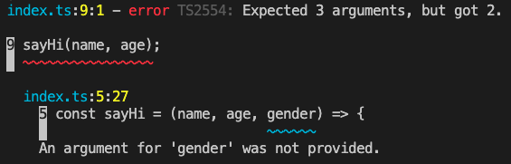

# TypeScript와 JavaScript의 차이점
## TypeScript의 특징
- 타입스크립트는 어떤 종류의 변수와 데이터인지 명시를 해줘야 한다.
- function의 경우에도 파라미터를 빼고 호출한다거나 할 때 자바스크립트에서는 에러가 발생하지 않고 정상적으로 수행되지만, 타입스크립트의 경우 컴파일 시 에러가 발생하게 된다.
#
- index.ts
```typescript
const name = "DoYeon",
    age = 32,
    gender = "male";

const sayHi = (name, age, gender) => {
    console.log(`Hello ${name}, you are ${age}, you are a ${gender}`);
};

sayHi(name, age);

export {};
```
- 이렇게 sayHi를 선언하고, sayHi에 name과 age만 넘기게 될 경우 컴파일 시 에러가 발생한다.

- 이 때 sayHi 선언문에서 gender에 '?'를 붙이면 에러가 발생하지 않게 된다.
```typescript
const sayHi = (name, age, gender?) => {
    console.log(`Hello ${name}, you are ${age}, you are a ${gender}`);
};
```
- '?'를 붙임으로써 해당 파라미터는 optional이라고 선언하게 되는 것이다.