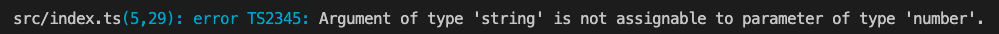

# TypeScript 특징
## TypeScript 데이터타입 지정
- 타입스크립트는 function을 선언할 때 각 파라미터의 타입을 어떤 타입으로 받을 것인지 지정할 수도 있다.
- 이렇게함으로써 어플리케이션의 규모가 커지더라도 어떤 타입을 넘겨야하는지 명확하게 할 수 있다.
#
- index.ts
```typescript
const sayHi = (name: string, age: number, gender: string) => {
    console.log(`Hello ${name}, you are ${age}, you are a ${gender}!`);
};

sayHi("DoYeon", "444", "male");

export {};
```
- 만약 위와 같이 age가 number로 선언되어있으나, string타입으로 넘기게 될 경우 컴파일 시 에러가 발생하게된다.

#
```typescript
const sayHi = (name: string, age: number, gender: string): void => {
    return `Hello ${name}, you are ${age}, you are a ${gender}!`;
};

console.log(sayHi("DoYeon", 32, "male"));

export {};
```
- 또한 function의 반환값에 대해서도 명확하게 선언해줄 수 있다.
- 만약 return 타입을 void로 선언하고 string을 반환할 경우 컴파일 시 에러가 발생하게 된다.
